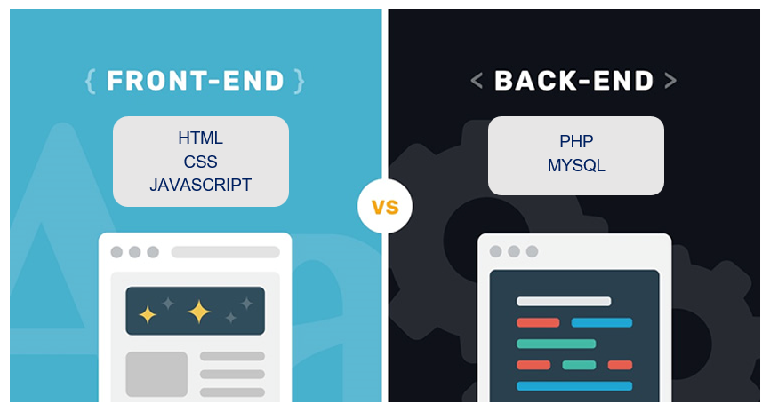

# Frontend webdevelopment met Javascript

Onder web development verstaan we het aanmaken van files die content zal beschikbaar stellen aan de gebruiker en interactie mogelijk zal maken.
We onderscheiden hier **Front-end** webdevelopment en **Back-end** webdevelopment.

 

**Front-end web development**

Front-end of client-side is een term gebruikt om duidelijk te maken dat de verwerking door de browser van de client gebeurt.

We onderscheiden hier:
* Een **HTML** bestand die zorgt voor de structuur van de pagina
* Een **CSS** bestand die zorgt voor de opmaak van de pagina
* Een **JS** bestand die zorgt voor dynamische mogelijkheden van de pagina

**Back-en web development**

Back-end of server-side is een term gebruikt om duidelijk te maken dat de verwerking door de webserver gebeurt.

We onderscheiden hier:
* Een **PHP** bestand die zorgt voor het genereren van HTML, CSS en JS bestanden die dan aan de browser kunnen aangeleverd worden.
* Een **Database** bv MYSQL die er voor zorgt dat data bewaard en geraadpleegd kan worden.

## Week 1 - Experimenteren met Javascript

[Hier](/files/cheatsheet_js.pdf) kan je een cheatsheet terugvinden ter ondersteuning van taken, toetsen, projecten en werkplekleren.

### Wat is Javascript precies?


**JavaScript** (JS) is een lichtgewicht, geïnterpreteerde programmeertaal met eersteklas functies. Hoewel het beste bekend als de scripttaal voor web pagina's, wordt het ook door vele niet-browser omgevingen gebruikt, zoals node.js. 

De standaard voor JavaScript is ECMAScript. Met de ingang van 2012, ondersteunen alle moderne browsers volledig ECMAScript 5.1. Op 17 juni 2015, publiceerde ECMA International de zesde hoofdversie (major version) van ECMAScript, dit heet officieel ECMAScript 2015, en wordt in het algemeen vaker aangeduid als ECMAScript 2015 of ES2015. Sindsdien worden de ECMAScript standaarden op jaarlijkse basis vrijgegeven.

Verwar JavaScript niet met de Java programmertaal. Beiden "Java" and "JavaScript" zijn handelsmerken of geregistreerde handelsmerken van Oracle in de VS en andere landen. Daarentegen hebben de twee programmeertalen hele verschillende syntaxis, semantiek en toepassingen.

Met Javascript kunnen webpagina's interactiever worden gemaakt door toegang te krijgen tot de inhoud en de opmaak van een webpagina en deze te wijzigen terwijl de pagina in de browser wordt bekeken. M.a.w. Javascript zorgt ervoor dat je een webpagina **interactief** kan maken zodat deze reageert op wat de gebruiker doet. Elke actie die moet gebeuren verloopt via een **script** en wordt door de browser, dus aan de **client-side**, verwerkt.

::: tip Ondersteunend leermateriaal

We raden jullie volgend ondersteunend leermateriaal aan:

* Ferguson, R. (2019). Beginning JavaScript: The Ultimate Guide to Modern JavaScript Development. [Link](https://limo.libis.be/primo-explore/fulldisplay?docid=TN_springer_s978-1-4842-4395-4_313453&context=PC&vid=VIVES_KATHO&search_scope=ALL_CONTENT&tab=all_content_tab&lang=nl_BE:) (je moet eerst inloggen via [limo](http://limo.libis.be/index.html#/vives) voor je deze link kan gebruiken)

* [Mozilla developer pagina](https://developer.mozilla.org/en-US/docs/Web/JavaScript)

* [LinkedIn Learning](https://www.academicsoftware.eu/) via Academic Software (kies voor Web Platform)

:::

### Problem solving

Als we code schrijven is dat meestal met vallen en opstaan. Fouten maken hoort hier nu eenmaal bij.
We onderscheiden twee type fouten:

* **Syntax fouten**: Dit zijn fouten waarbij de syntax van Javascript niet correct is. Meestal zijn dit typfouten of stukjes die we vergeten zijn.
* **Logica fouten**: Hier is de syntax van Javascript correct maar het resultaat is niet wat we verwacht of bedoeld hadden. De fout ligt hierin de logica van ons programma, wat moeilijker te achterhalen valt.

Gelukkig heeft onze browser een ontwikkelomgeving die ons hierbij kan helpen. Voor Google Chrome open je dit via `F12` en in Safari kan je dit openen via het `Develop > Show Web Inspector` menu.

Je kan waarden van variabelen loggen naar de console om zo proberen logica fouten op te sporen.

```js
console.log('Resultaat : ' + totaal);
```

Soms is de fout wat complexer en moeten we debuggen.
Bekijk even de informatie op de [developer pagina van Chrome](https://developer.chrome.com/docs/devtools/javascript/)


Laten we even de fouten uit volgend project halen...


### Oefening

::: tip Online scripts implementeren

Maak de oefening op het elektronisch leerplatform en laad die op.

:::

### Take-home opdracht

::: tip Herhaling Javascript

Als voorbereiding op de leerstof van volgende week volg je onderstaande videotutorial:

* Hoofdstuk 1 - 4 van [Learning the javascript Language](https://www.linkedin.com/learning/learning-the-javascript-language-2)

:::

## Week 2 - De syntax van Javascript

### Javascript toevoegen aan je html pagina.

Je kunt ervoor kiezen om een script block toe te voegen aan je html pagina. Indien mogelijk vermijd je deze techniek.

```html
<body>
    <script type="text/javascript">
        // hier komt dan de java code
    </script>
</body>
```
Of je kan terug met een aparte file werken, wat de voorkeur geniet.

```html
<body>
    <!-- hier komt de volledige body van de html pagina -->

    <script src="/scripts/script.js"></script>
</body>
```

::: tip Tip
Maak een folder 'scripts' aan waarin je de Javascript bestanden plaatst.

Voeg je script steeds **onderaan je body** toe, zo krijgt de gebruiker je webpagina reeds te zien terwijl het script nog aan het laden is bij een trage internetverbinding.

Als je in javascript andere javascripts gebruikt moet je die voor jou script link plaatsen in de body.
:::

### Variabelen

In javascript zijn variabelen 'loosely typed', wat wil zeggen dat het datatype afhankelijk is van wat je in de variabele stopt. Je kan dus perfect het ene moment een integer in een variabele hebben en enkele ogenblikken later een string in diezelfde variabele hebben.

**Let**
```js
let y = 13
```
Let is een variabele definitie die enkel geldig is binnen de block-scope `{}` waarin hij is gedefinieerd.

**var**
```js
var y = 12
```
Var is een algemene variabele definitie, als je die dus binnen een functie definieert is de functie de scope van de variabele, als je die bovenaan plaatst wordt de volledige script-file de scope.

**const**
```js
const y = 11
```
Const is de definitie van een constante, heeft dezelfde scope als let maar je kan de waarde niet aanpassen.

::: warning Aandacht
Als je een variable definieert zonder let, var of const dan is dit automatisch een globale variabele. Je moet dan ook goed opletten dat je nergens anders een variabele definieert met dezelfde naam.

Om te vermijden dat je die let, var of const per ongeluk zou vergeten kan je bovenaan je script file "use strict"; plaatsen. Je krijgt dan een foutmelding als je het vergeet.

```js
'use strict';

let somevariable;
```
:::

### Datatypes

Binnen javascript worden 7 primitieve datatypes gebruikt:
* Boolean : true of false
* Number : integer of float
* BigInt : een integer met onbeperkte grootte, te herkennen aan een kleine n na het getal bv `23232n`
* String : tekst
* Undefined : het datatype is nog niet gedefinieerd bv `let a;`
* Null : om een speciale waarde 'null' aan te geven
* Symbol : elke instantie is uniek, bv `Symbol("description");`

Daarnaast heb je nog het object type die gebruikt kan worden om een verzameling van waarden te bewaren.
```js
let obj = {name: 'Piet', age : 5};
```
Er zijn nog 4 speciale object type:
* Function
* Array
* Date
* RegExp

Laten we dit even bekijken in de console van chrome. Start Chrome op en ga naar  `about:blank` om een lege webpagina te krijgen. Druk vervolgens op F12 en ga naar de console.

```js
let n=5   // het resultaat is 5
n = 0xF   // het resultaat is 15 (hexadecimaal getalstelsel)
n = 015   // het restulaat is 13 (octaal getalstelsel)

'5'== 5   // het resultaat is true (== kijkt niet naar het datatype)
'5'===5   // het resultaat is false (==== doet dat wel)

let myString = "Hello World";
myString.length         // het resultaat is 11
myString.toUpperCase()  // het resultaat is HELLO WORLD

// ook hier kan je \n en \t gebruiken voor nieuwe lijn of tab

`value of n is ${n}`    // geformateerde string
n.toString()            // datatype conversie

let obj = { name: 'Carrot', for: 'Max', details: { color: 'orange', size: 12}};
obj.name                // het resultaat is Carrot

let obj2=obj            // let op is geen kopie maar een 2de verwijzing naar hetzelfde object
obj2.name = 'Apple'     // dit zal dus bij beide objecten de name wijzigen naar Apple.

let a = { x: {z:1} , y:2};
let b = JSON.parse(JSON.stringify(a)); // dit zorgt voor een deepcopy van het object, dit zijn dus twee verschillende objecten.

let myArray = [];
myArray = [5,'Hello',{name:'Piet'}];
myArray[1];             // Het resultaat is Hello, een array start steeds op positie 0
myArray[10]='hi';       // Voegt een nieuw item toe op positie 10 maar zal ook tussen positie 2 en 10 lege plaatsen aanmaken
myArray.push('Test');    // Zal een nieuw item achteraan de array toevoegen.
myArray.pop();           // Zal het laatste item van de array verwijderen
```

### Logische operatoren

We kunnen in javascript de gekende logische operatoren gebruiken om condities te  bouwen:

* `&&` de EN operator
* `||` de OF operator
* `!` de NIET operator

Bijzonder bij de interpretatie van condities is dat javascript de conditie bekijkt tot de uitkomst met zekerheid vastligt, de rest van de conditie wordt op dat ogenblik niet meer geinterpreteerd.
```js
false && (a=2)  // linker deel is false, dus de conditie is false, a=2 zal niet meer uitgevoerd worden.
```
### Beslissingen

We kunnen in javascript de gebruikelijke beslissingsstructuren gebruiken:

```js
if(...){
  // code
}
else if(...){
  // code
}
else {
  // code
}

switch(answer){
  case "YES":
    // code
    break;
  default:
    // code
    break;
}
```
Daarnaast hebben we ook de ternary operator:
```js
(animal === 'cat') ? console.log("cat") : console.log("no cat");
```

### Oefening

::: tip Oefenen met variabelen, array, object en operaties

Maak de oefening op het elektronisch leerplatform en laad die op.

:::

### Take-home opdracht

::: tip Herhaling Javascript

Als voorbereiding op de leerstof van volgende week volg je onderstaande videotutorial:

* Hoofdstuk 5 en 6 van [Learning the javascript Language](https://www.linkedin.com/learning/learning-the-javascript-language-2)

:::

## Week 3 - De syntax van Javascript (vervolg)

### Herhalingen

We kunnen in javascipt ook met lussen werken:

```js
// for lus
for (let i=0; i<10; i++){}
// for-of lus
let names = ['Piet','Jan','Pol'];
for (let name of names) {
   	console.log(name);
};
// for-in lus
let names = {n1:'Piet',n2:'Jan',n3:'Pol'};
for (let i in names) {
   	if(names.hasOwnProperty(i)) console.log(names[i]);
};
// while lus
let count = 5;
while (count > 0){
  console.log(count);
  count--;
}
//do-while lus
let count = 5;
do {
  console.log(count);
  count--;
} while (count > 0);
```
### Functies

We kunnen in javascript eveneens met methoden en functies werken:
```js
// methode
function sayMessage(message){
   if(typeof(message)==='string') console.log(message);
}
// functie
function isEven(n) {
  return ((n%2)===0); 
}
// oproepen van de functie
let even=isEven(10);
```
Daarnaast kunnen we hier eveneens met parameters werken:
```js
// functie met default parameters
function sayMessage(message, times){
  times=(typeof(times)!=='undefined') ? times:10;
  if(typeof(message)==='string'){
    for(let i=0;i<times;i++) console.log(message);
  }
}
// functie met het aantal parameters naar keuze, parameters komen in de array 'arguments'
function sayMessages(){
  for (let i=0; i< arguments.length; i++) console.log(arguments[i]);
}
```
Het doorgeven van parameters werkt hier eveneens op het principe van 'pass by value', d.w.z. dat de waarde van tijdelijk wordt gekopierd naar een lokale variabele. Dat is echter niet het geval voor reference variablen zoals bv een object. daar geld het principe van 'pass by reference' en is er sprake van een tijdelijke variabele die verwijst naar de originele.

```js
// pass by value voorbeeld
let boodschap='hi';
function changeMessage(message){
  message="test";
}
changeMessage(boodschap);
console.log(boodschap);    // het resultaat is 'hi'

// pass by reference voorbeeld
let obj={msg:'hi'};
function changeMessage(message){
  message.msg="test";
}
changeMessage(obj);
console.log(obj.msg);   	// het resultaat is 'test'
```

Verder kan je creatief omgaan met functies.

```js
// een functie als een variabele
let sayMessage= function(message){ console.log(message); }
// een functie meegeven als een parameter
window.setTimeout(sayMessage,5000,'Hi');
// een functie als deel van een object
let obj= { f: function(message){ console.log(message); } };
obj.f('Hi');
// een anonieme functie ( die heeft geen naam)
nummers.forEach( function(i) {console.log("array bevat ",i);})
// een arrow functie
verdubbel = i => (i*2);
```
Een functie die meegeven wordt als parameter met een andere functie noemen we een **'callback functie'**.

### Error afhandeling

Net zoals in C# kan je met `try` en `catch` de error afhandeling voorzien.

```js
try {
  // hier komt de code die je wil uitvoeren
} catch (e){
  console.warn(e); // als er een fout optreed zal deze naar de console worden gestuurd.
}
```

### Commentaar voorzien

Zoals steeds is het 'good-practice' om je code van commentaar te voorzien.

```js
/**
  * Een blok aan commentaar
  * over meerdere lijnen
  */

// Commentaar op 1 enkele lijn.
```

### HTML elementen vinden

Om in javascript elementen van een html pagina op te vragen bestaan er enkele mogelijkheden:

* getElementById() : één element met een bepaald id
* getElementByName() : lijst van elementen met een bepaalde naam
* getElementByTagName() : lijst van een bepaald type elementen
* querySelectorAll() : lijst van elementen die voldoet aan een CSS selector
* querySelector() : eerste element die voldoet aan een CSS selector

### Good practices

* Als je manuele indentatie voorziet, gebruik dan steeds ofwel spaties ofwel tabs maar combineer ze niet.
* Voorzie je code van commentaar zodat je code vlotter begrijpbaar is.
* Plaats spaties:
  * na een `,`, `:`, `;` maar niet er voor
  * na een `if`, `for`, `while` en `function`
  * voor en na een operator (`==`, `<`, `&&`, `+`, ...)
* Vermijd het gebruik van `var` om een variabele te definiëren

### Oefening

::: tip Oefenen met controle structuren, loops en functies

Maak de oefening op het elektronisch leerplatform en laad die op.

:::

## Week 4 - Javascript voor grafische designers

Web designers maken gebruik van Javascript om hun webpagina's visueel aantrekkelijker en gebruiksvriendelijker te maken terwijl een web developer eerder javascript zal gebruiken om zaken in de achtergrond te regelen zoals bv. het binnen halen van data en toevoegen aan een tabel.

Laten we even enkele voorbeelden bekijken:

* Een titel openklappen zodat de inhoud zichtbaar wordt : [W3Schools](https://www.w3schools.com/howto/howto_js_collapsible.asp)
* Inhoud weergeven in tabbladen : [W3Schools](https://www.w3schools.com/howto/howto_js_tabs.asp)
* Een navigatiebar die bovenaan de pagina blijft kleven : [W3Schools](https://www.w3schools.com/howto/tryit.asp?filename=tryhow_js_navbar_sticky) 
* Een ingezoomde versie van een afbeelding weergeven : [W3Schools](https://www.w3schools.com/howto/howto_js_image_zoom.asp)
* Een video in de achtergrond met pauze mogelijkheid : [W3Schools](https://www.w3schools.com/howto/howto_css_fullscreen_video.asp)
* Een slideshow of carousel : [W3Schools](https://www.w3schools.com/howto/howto_js_slideshow.asp)
* Een slideshow met gallerij : [W3Schools](https://www.w3schools.com/howto/howto_js_slideshow_gallery.asp)

### Oefening

::: tip Oefenen om je webpagina echt tot leven te laten komen

Maak de oefening op het elektronisch leerplatform en laad die op.

:::

### Take-home opdracht

::: tip Herhaling Javascript

Als voorbereiding op de leerstof van volgende week volg je onderstaande videotutorial:

* Hoofdstuk 1 en 3 van [Learning the javascript Language](https://www.linkedin.com/learning/validating-and-processing-forms-with-javascript-and-php)

:::

## Week 5 - Form validatie in Javascript

Ter ondersteuning van deze leerstof raden we je aan om volgende bronnen te raadplegen:

* [Form validation](https://developer.mozilla.org/en-US/docs/Learn/Forms/Form_validation)
* [HTML5 input types](https://developer.mozilla.org/en-US/docs/Learn/Forms/HTML5_input_types)

We gaan in dit voorbeeld een stapje verder en combineren HTML, CSS en JAVASCRIPT met Node-red en Google Mail.

Je zou bv op basis van dit voorbeeld een webinterface kunnen maken voor een IoT-device.

### Form validatie via javascript

We maken eerst een form waarvan we de validatie doen aan de client-side d.m.v. javascript en html.


Je kan de files van dit voorbeeld [hier](/files/formvalidation.rar) downloaden.

We gebruiken hier geen HTML validatie, enkel javascript validatie.
Laten we even kijken naar het script.

```js
// Functie die uitgevoerd wordt bij een on submit
function ValidationEvent() {
    // Input in variabelen bewaren
    let name = document.getElementById("name").value;
    let email = document.getElementById("email").value;
    let contact = document.getElementById("contact").value;
    // Reguliere expressie voor email
    let emailReg = /^\w+([\.-]?\w+)*@\w+([\.-]?\w+)*(\.\w{2,3})+$/;
    // Validatie testen
    if (name != '' && email != '' && contact != '') {
        if (email.match(emailReg)) {
            if (document.getElementById("male").checked || document.getElementById("female").checked) {
                if (contact.length >= 9 ) {
                    return true;
                } else {
                    alert("The Contact No. must be at least 9 digit long!");
                    return false;
                }
            } else {
                alert("You must select gender.....!");
                return false;
            }
        } else {
            alert("Invalid Email Address...!!!");
            return false;
        }
    } else {
        alert("All fields are required.....!");
        return false;
    }
}
```

Je merkt dat we eerst alle input van de gebruiker gaan bewaren in variabelen. Dat is steeds een goed idee, meestal moet dit toch in een database raken en de controle loopt op die manier vlotter.

Om het email-adres te valideren maken we gebruik van een reguliere expressie.

Je kan meer informatie hierover lezen op [mozilla developer](https://developer.mozilla.org/nl/docs/Web/JavaScript/Guide/Reguliere_Expressies).

Een handige tool om die reguliere expressies te ontleden is [regexper](https://regexper.com/#%2F%5Ethis%5C.%2F).

In dit voorbeeld werken we met een geneste if structuur om alle input te valideren. Als je meer inputvelden moet valideren is het aangewezen om via een boolean variabele te werken die bijhoud of de volledige form valid of niet is.

Je merkt ook dat telkens iets niet valid is er een false wordt retourneert, moesten we dit niet doen zou de pagina gewoon refreshen.

### Oefening

::: tip Oefenen om forms met meerdere inputvarianten te valideren

Maak de oefening op het elektronisch leerplatform en laad die op.

:::

## Week 6 - Gebruik maken van Web-API's in Javascript

### JavaScript Object Notation (JSON)

 

JSON is een formaat om op eenvoudige en compacte manier data te kunnen uitwisselen. Er zijn 2 structuren, objecten te herkennen aan {} en array’s te herkennen aan [].


```json
{
  "my_name": "Piet",
  "my_number": 23,
  "my_object": {
    "my_array": [
      5,
      6,
      7
    ]
  }
}
```

Om een JSON string om te zetten naar een JSON object gebruik je de .parse() methode. 

Test dit even uit in de console:
```js
const json = '{"result":true, "count":42}';
const obj = JSON.parse(json);
```

**Merk op** dat bij een combinatie van “, je hier best de buitenste aanpast naar ‘.

Om een JSON object om te zetten naar een string gebruik je de .stringify() methode.

Test dit even uit in de console:
```js
console.log(JSON.stringify({ x: 5, y: 6 }));
// expected output: "{"x":5,"y":6}"
```

### Asynchronous Javascript And XML (AJAX)

AJAX is een techniek om je webpagina te updaten zonder dat de volledige pagina opnieuw moet worden geladen.
Het is Google die deze techniek heeft geïntroduceerd in hun zoekmachine (als je in google iets begint te type worden suggesties gegeven).


Aanvankelijk werd hiervoor HTMLXMLRequest gebruikt, het grote nadeel was dat je voor elke browser een andere code nodig had.
Enige tijd late werd **JQuery** ontwikkeld waarmee je uniforme code kon schrijven en JQuery ging in de achtergrond dan het probleem van de verschillende browsers aanpakken.

Het is goed dat je JQuery kent maar voor nieuwe ontwikkelingen gebruik je het beter niet meer. Er wordt niet meer verder aan ontwikkeld. In de plaats hiervan gebruikt men nu de **‘fetch’ interface** die ingebouwd zit in de browsers.

Je kan [hier](https://www.w3schools.com/jquery/jquery_intro.asp) meer info over JQuery terugvinden.

Onthou vooral dat als je **een $-teken** in Javascript ziet staan dan heb je te maken met JQuery.

::: tip
Jquery moet eerst geladen zijn voor je de javascript laadt andersom zal de javascript die $ verwijzing niet begrijpen.
:::

Het probleem van code in een browser is dat deze rechtlijnig werkt en nergens kan halthouden. Moest je via Javascript code proberen te laten wachten op iets dan zou de browser denken dat de pagina blijft “hangen” en deze dus onderbreken.

Om dus te kunnen wachten op iets moet je het anders aanpakken:

* Via Callback (is een oude technologie)
*	Via Promise (is iets nieuwer)
*	Via Async en Await (is de nieuwste ontwikkeling)

#### Een callback voorbeeld via JQuery

```js
$(document).ready(function(){
    var data;
    document.getElementById('get').addEventListener('click',getData);
    function getData() {
        $.get("https://httpbin.org/get?a=1",processData);
    }
    function processData(response)
    {
        document.getElementById('result').textContent=JSON.stringify(response.args);
    }
  });
```

**$.get(url, callback functie)**: De url zal dus bevraagd worden, pas als er antwoord komt zal de callback functie worden uitgevoerd.

**Httpbin.org** is dummy server waar je de respons kunt meegeven en terugkrijgt, is om te testen

Het grootste probleem hierbij is als je een callback functie in een andere callback functie gebruikt is error afhandeling bijzonder moeilijk.

#### Een promise voorbeeld via fetch API

```js
document.getElementById('get').addEventListener('click', getData);
function getData() {
    fetch("https://httpbin.org/get?a=1").then(response => response.json()).
    then(response => { document.getElementById('result').textContent=
		JSON.stringify(response.args);  });
};
```
De fetch API is ingebouwd in de browser en werkt via promises. Op het einde van een ketting van .then() is er een .catch() om de errorafhandeling te doen.

De response komt al vanaf de eerste data die de server teruggestuurd, daarom moeten we response.json() gebruiken om alle response te verzamelen.

#### Een async/await voorbeeld

```js
document.getElementById('get').addEventListener('click', getData);
 async function getData() {
    let response = await fetch("https://httpbin.org/get?a=1");
    let json = await response.json();
    document.getElementById('result').textContent=
            JSON.stringify(json.args);
};
```

Je merkt dat via deze techniek de code veel leesbaarder lijkt en eerder trekt op gewone code zoals bij c# (code regel per code regel)

De functie zal bij elke Await de code verlaten en later op dat punt dan verder doen als de info beschikbaar is.

**Let op**: Deze techniek werkt niet bij oude browsers!

### Web API

Een Application Programming Interface is een software service dat een set aan functies online beschikbaar stelt voor anderen.

Zoals bv:
* lezen en opzoeken van data
* weer service
* het updaten van content
* autentificatie
* complexe berekeningen
* comprimeren of converteren van afbeeldingen

Het vinden van een API kan lastig zijn. Alle grote web applicaties zoals Youtube, Google Maps, Dropbox, Twitter, ... hebben er een, maar er zijn ook ontelbare kleine specifieke API's die je ofwel doorkrijgt van een fabrikant of eventueel kan opzoeken via [rapidapi.com](https://rapidapi.com/marketplace).

**Let op:** Niet alle API's zijn zomaar gratis!

### Oefening

::: tip Oefenen de weersvoorspelling netjes te visualiseren

Maak de oefening op het elektronisch leerplatform en laad die op.

:::
