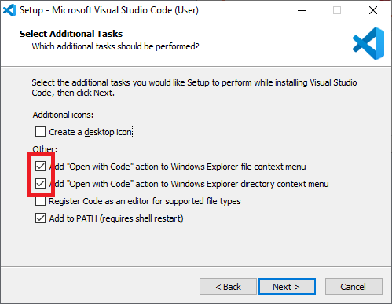
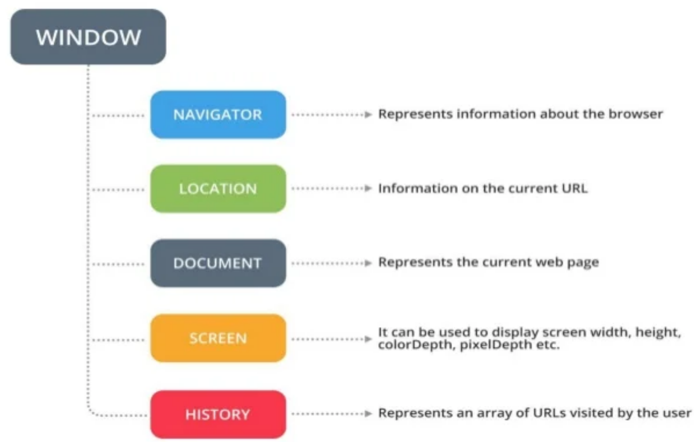
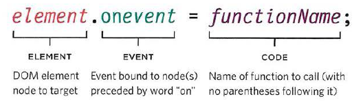
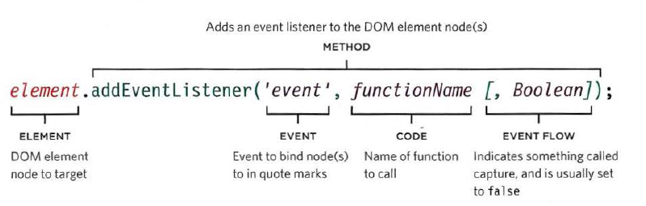
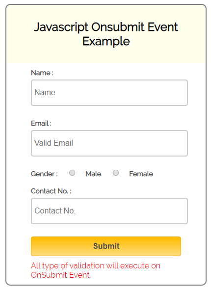
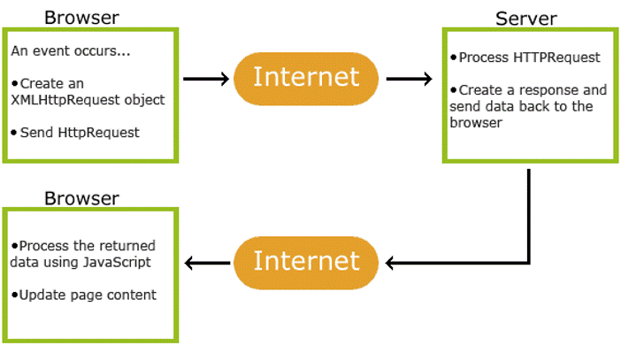
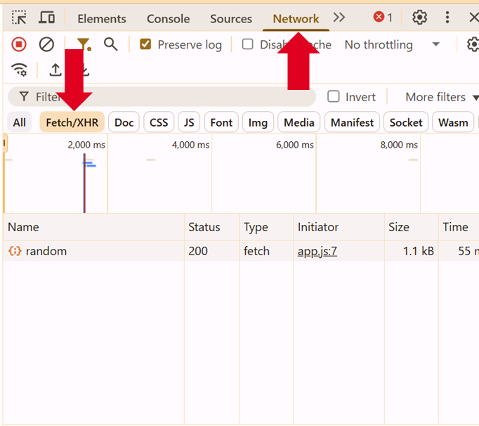
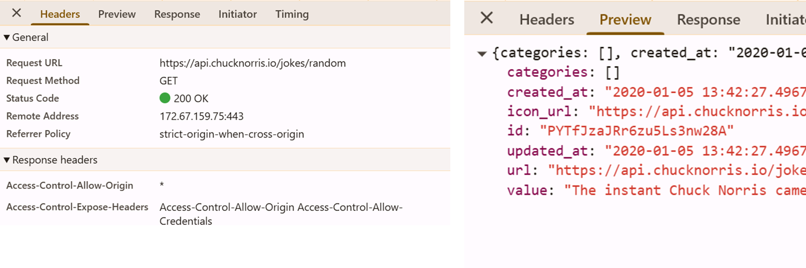
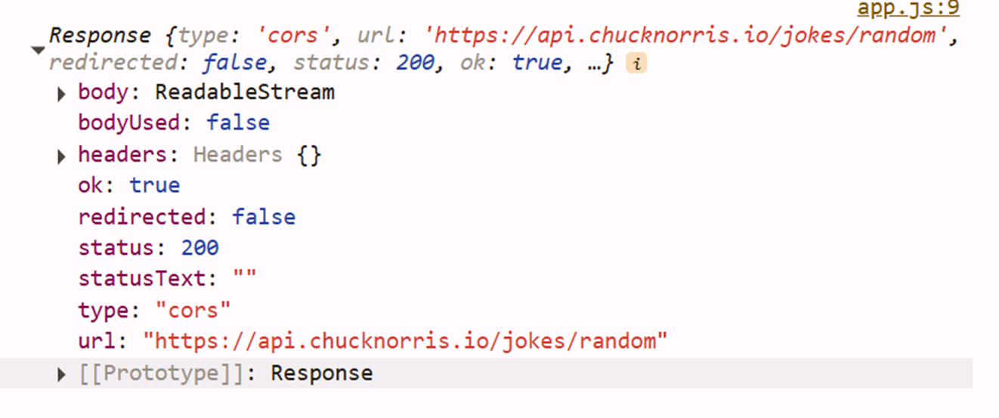

# Front-end webdevelopment met JavaScript

Onder web development verstaan we het aanmaken van files die content zal beschikbaar stellen aan de gebruiker en interactie mogelijk zal maken.
We onderscheiden hier **Front-end** webdevelopment en **Back-end** webdevelopment.


**Front-end web development**

Front-end of client-side is een term gebruikt om duidelijk te maken dat de verwerking door de browser van de client gebeurt.

We onderscheiden hier:
* Een **HTML** bestand die zorgt voor de structuur van de pagina
* Een **CSS** bestand die zorgt voor de opmaak van de pagina
* Een **JS** bestand die zorgt voor dynamische mogelijkheden van de pagina

**Back-en web development**

Back-end of server-side is een term gebruikt om duidelijk te maken dat de verwerking door de webserver gebeurt.

We onderscheiden hier:
* Een **PHP** bestand die zorgt voor het genereren van HTML, CSS en JS bestanden die dan aan de browser kunnen aangeleverd worden.
* Een **Database** bv MYSQL die er voor zorgt dat data bewaard en geraadpleegd kan worden.

## Installatie software

We maken gebruik van Visual Studio Code om onze projecten in te bouwen.
Als dit nog niet op jou systeem geïnstalleerd staat, ga dan naar [de website van Visual Studio Code](https://code.visualstudio.com/) en download er de versie voor jou systeem.
Tijdens de installatie zorg je ervoor dat volgende 2 opties aangevinked staan:



Na installatie voeg je ook de **live server extensie** toe.
Bekijk [de gebruikersgids van Visual Studio Code](https://code.visualstudio.com/docs/editor/extension-marketplace) voor meer informatie hoe je dit moet doen.

## Week 1 - Experimenteren met JavaScript

[Hier](/files/cheatsheet_js.pdf) kan je een cheatsheet terugvinden ter ondersteuning van taken, toetsen, projecten en werkplekleren.

### Wat verstaan we onder een computerprogramma ?

Een computerprogramma is **een opeenvolging van instructies** met als doel om **een specifieke taak met een computer uit te voeren**.

In zijn eenvoudigste vorm kan je dit vergelijken met bv 
* Een recept
* Een muziekpartituur
* Een breipatroon
* Een gebruiksaanwijzing
* De montage instructies van Ikea

Als voorbeeld nemen we een fles shampoo, het ‘programma’ zou dan kunnen zijn :

1. Maak het haar nat
2. Doe er de shampoo op
3. Wrijf de shampoo door het haar
4. Spoel de shampoo uit je haar
5. Droog je haar af

:::warning ❗Definitie
Een programma is dus een logische opeenvolging van handelingen/instructies die er voor zorgen dat een taak volbracht kan worden.
:::

:::tip Oefening - ga in groepjes zitten en schrijf de instructies neer om: 
* Een biefstuk te bakken
* Een pint te tappen
* Vers gesneden frietjes te bakken
* Te tanken
* Een straat over te steken op het zebrapad
:::

Om er voor te zorgen dat de computer onze instructies begrijpt moeten we een taal gebruiken die wij kunnen lezen/programmeren en die de computer kan verstaan.

Zo’n taal noemen we een **programmeertaal**. 

* Java
* Python
* C / C++ / C#
* …

In deze cursus zullen we **JavaScript** gaan gebruiken, wat eigenlijk onder de categorie script valt (later meer hierover).

### Op verkenning door onze laptop
Laten we **Windows Verkenner** even opstarten.
* Wat staat er allemaal op onze C-schijf (OS-drive).
* Sommigen hebben een D-schijf (Data-drive).
* Waar staat onze software en waar schrijven we onze DATA weg?

:::warning 👍‘Good Practice’
* Maak een folder waar je alles van school in plaatst
(vb School of Vives of Graduaat CDD of …)
* Maak een folder waar je alles van dit vak plaatst
(vb Frontend webdevelopment )
* Voor elk project (oefening, voorbeeld, taak,… ) zal ook een een folder aangemaakt worden.
:::

Een projectfolder bevat meestal volgende files en subfolders:
* Een folder `images` waarin alle afbeeldingen staan
* Een folder `scripts` waarin alle `.js` bestanden komen
* Een folder `styles` waarin alle `.css` bestanden komen
* Verder heb je alle `.html` en `.php` bestanden die meestal niet in een subfolder staan.

:::warning Indienen files
Om een oefening of taak in te dienen moet je de projectfolder comprimeren naar een ZIP-file en die file via Toledo indienen. 

**Let op:** Een ZIP-file kan je niet doormailen binnen VIVES, daarvoor gebruik je dan WinRAR. 
:::

### Wat is JavaScript precies?


**JavaScript** (JS) is een lichtgewicht, geïnterpreteerde programmeertaal met eersteklas functies. Hoewel het beste bekend als de scripttaal voor web pagina's, wordt het ook door vele niet-browser omgevingen gebruikt, zoals node.js. 

De standaard voor JavaScript is ECMAScript. Met de ingang van 2012, ondersteunen alle moderne browsers volledig ECMAScript 5.1. Op 17 juni 2015, publiceerde ECMA International de zesde hoofdversie (major version) van ECMAScript, dit heet officieel ECMAScript 2015, en wordt in het algemeen vaker aangeduid als ECMAScript 2015 of ES2015. Sindsdien worden de ECMAScript standaarden op jaarlijkse basis vrijgegeven.

Verwar JavaScript niet met de Java programmertaal. Beiden "Java" and "JavaScript" zijn handelsmerken of geregistreerde handelsmerken van Oracle in de VS en andere landen. Daarentegen hebben de twee programmeertalen hele verschillende syntaxis, semantiek en toepassingen.

Met JavaScript kunnen webpagina's interactiever worden gemaakt door toegang te krijgen tot de inhoud en de opmaak van een webpagina en deze te wijzigen terwijl de pagina in de browser wordt bekeken. M.a.w. JavaScript zorgt ervoor dat je een webpagina **interactief** kan maken zodat deze reageert op wat de gebruiker doet. Elke actie die moet gebeuren verloopt via een **script** en wordt door de browser, dus aan de **client-side**, verwerkt.

::: tip 📖Ondersteunend leermateriaal

We raden jullie volgend ondersteunend leermateriaal aan:

* Ferguson, R. (2019). Beginning JavaScript: The Ultimate Guide to Modern JavaScript Development. [Link](https://limo.libis.be/primo-explore/fulldisplay?docid=TN_springer_s978-1-4842-4395-4_313453&context=PC&vid=VIVES_KATHO&search_scope=ALL_CONTENT&tab=all_content_tab&lang=nl_BE:) (je moet eerst inloggen via [limo](http://limo.libis.be/index.html#/vives) voor je deze link kan gebruiken)

* [Mozilla developer pagina](https://developer.mozilla.org/en-US/docs/Web/JavaScript)

* [LinkedIn Learning](https://www.academicsoftware.eu/) via Academic Software (kies voor Web Platform)

:::

### Problem solving

Als we code schrijven is dat meestal met vallen en opstaan. Fouten maken hoort hier nu eenmaal bij.
We onderscheiden twee type fouten:

* **Syntax fouten**: Dit zijn fouten waarbij de syntax van JavaScript niet correct is. Meestal zijn dit typfouten of stukjes die we vergeten zijn.
* **Logica fouten**: Hier is de syntax van JavaScript correct maar het resultaat is niet wat we verwacht of bedoeld hadden. De fout ligt hierin de logica van ons programma, wat moeilijker te achterhalen valt.

Gelukkig heeft onze browser een ontwikkelomgeving die ons hierbij kan helpen. Voor Google Chrome open je dit via `F12` en in Safari kan je dit openen via het `Develop > Show Web Inspector` menu.

Je kan waarden van variabelen loggen naar de console om zo proberen logica fouten op te sporen.

```js
console.log('Resultaat : ' + totaal);
```

Soms is de fout wat complexer en moeten we debuggen.
Bekijk even de informatie op de [developer pagina van Chrome](https://developer.chrome.com/docs/devtools/javascript/)

### Oefeningen

::: tip Online scripts implementeren

Maak de oefeningen op het elektronisch leerplatform en laad die op.

:::

### Take-home opdracht

::: tip Voorbereiding volgende les

Als voorbereiding op de leerstof van volgende week volg je onderstaande videotutorial:

* Hoofdstuk 1 - 4 van [Learning the javascript Language](https://www.linkedin.com/learning/learning-the-javascript-language-22309208)

:::

## Week 2 - De syntax van JavaScript

### JavaScript toevoegen aan je html pagina.

Je kunt ervoor kiezen om een script block toe te voegen aan je html pagina. Indien mogelijk vermijd je deze techniek.

```html
<body>
    <script>
        // hier komt dan de JavaScript code
    </script>
</body>
```
Of je kan terug met een aparte file werken, wat de voorkeur geniet.

```html
<body>
    <!-- hier komt de volledige body van de html pagina -->

    <script src="/scripts/script.js"></script>
</body>
```

Als de browser een `<script>` element tegen komt zal het op die plaats pas het script laden en kijken of het iets moet doen.

::: tip 💡Tip
Maak een folder 'scripts' aan waarin je de JavaScript bestanden plaatst.

Voeg je script steeds **onderaan je body** toe, zo krijgt de gebruiker je webpagina reeds te zien terwijl het script nog aan het laden is bij een trage internetverbinding.

Als je in JavaScript andere scripts gebruikt moet je die voor jou script link plaatsen in de body.

✏️ **UPDATE**

Een nieuwere techniek om er voor te zorgen dat de DOM van je HTML laad voor je script is het gebruik maken van het attribuut `defer`. Dit zorgt er voor dat het script laad in de achtergrond maar pas uitgevoerd wordt als de DOM volledig is opgebouwd.

```html
<script defer src="/scripts/script.js"></script>
```
Hierdoor is het minder belangrijk om je scripts onderaan de body te plaatsen, maar mag je die gewoon ook in de head plaatsen.
:::

### Variabelen

Een variabele is een container of doos waarin je informatie kan bewaren.

In JavaScript zijn variabelen 'loosely typed', wat wil zeggen dat het datatype afhankelijk is van wat je in de variabele stopt. Je kan dus perfect het ene moment een integer in een variabele hebben en enkele ogenblikken later een string in diezelfde variabele hebben.

**Let**
```js
let y = 13
```
Let is een variabele definitie die enkel geldig is binnen de block-scope `{}` waarin hij is gedefinieerd.

**var**
```js
var y = 12
```
Var is een algemene variabele definitie, als je die dus binnen een functie definieert is de functie de scope van de variabele, als je die bovenaan plaatst wordt de volledige script-file de scope.

**const**
```js
const y = 11
```
Const is de definitie van een constante, heeft dezelfde scope als let maar je kan de waarde niet aanpassen.

::: warning ❗Aandacht
Als je een variable definieert zonder let, var of const dan is dit automatisch een globale variabele. Je moet dan ook goed opletten dat je nergens anders een variabele definieert met dezelfde naam.

Om te vermijden dat je die let, var of const per ongeluk zou vergeten kan je bovenaan je script file "use strict"; plaatsen. Je krijgt dan een foutmelding als je het vergeet.

```js
'use strict';

let somevariable;
```
:::

👉**Regels omtrent naamgeving van variabelen**

1. De naam moet met een letter, een `$` of een `_` starten. Nooit met een cijfer!
2. De naam kan letters, cijfers, een `$` of een `_` bevatten. Nooit een `-`  of `.`!
3. Je kan geen woorden gebruiken die een script betekenis hebben (bv. var).
4. De naam is hoofdletter gevoelig, je start die altijd met een kleine letter. Je hergebruikt nooit een variabele naam met een andere hoofdletter combinatie.
5. Gebruik een naam dat de informatieinhoud ervan beschrijft. 
6. Als een naam uit meerdere woorden bestaat gebruik je voor het tweede woord een hoofdletter (bv. firstName) of een `_` (bv. first_name).

### Datatypes

Binnen JavaScript worden 7 primitieve datatypes gebruikt:
* Boolean : true of false
* Number : integer of float
* BigInt : een integer met onbeperkte grootte, te herkennen aan een kleine n na het getal bv `23232n`
* String : tekst
* Undefined : het datatype is nog niet gedefinieerd bv `let a;`
* Null : om een speciale waarde 'null' aan te geven
* Symbol : elke instantie is uniek, bv `Symbol("description");`

Daarnaast heb je nog het object type die gebruikt kan worden om een verzameling van waarden te bewaren.
```js
let obj = {name: 'Piet', age : 5};
```
Er zijn nog 4 speciale object type:
* Function
* Array
* Date
* RegExp

Laten we dit even bekijken in de console van chrome. Start Chrome op en ga naar  `about:blank` om een lege webpagina te krijgen. Druk vervolgens op F12 en ga naar de console.

```js
let n=5   // het resultaat is 5
n = 0xF   // het resultaat is 15 (hexadecimaal getalstelsel)
n = 015   // het restulaat is 13 (octaal getalstelsel)

'5'== 5   // het resultaat is true (== kijkt niet naar het datatype)
'5'===5   // het resultaat is false (==== doet dat wel)

let myString = "Hello World";
myString.length         // het resultaat is 11
myString.toUpperCase()  // het resultaat is HELLO WORLD

// ook hier kan je \n en \t gebruiken voor nieuwe lijn of tab

`value of n is ${n}`    // geformateerde string
n.toString()            // datatype conversie

let obj = { name: 'Carrot', for: 'Max', details: { color: 'orange', size: 12}};
obj.name                // het resultaat is Carrot

let obj2=obj            // let op is geen kopie maar een 2de verwijzing naar hetzelfde object
obj2.name = 'Apple'     // dit zal dus bij beide objecten de name wijzigen naar Apple.

let a = { x: {z:1} , y:2};
let b = JSON.parse(JSON.stringify(a)); // dit zorgt voor een deepcopy van het object, dit zijn dus twee verschillende objecten.

let myArray = [];
myArray = [5,'Hello',{name:'Piet'}];
myArray[1];             // Het resultaat is Hello, een array start steeds op positie 0
myArray[10]='hi';       // Voegt een nieuw item toe op positie 10 maar zal ook tussen positie 2 en 10 lege plaatsen aanmaken
myArray.push('Test');    // Zal een nieuw item achteraan de array toevoegen.
myArray.pop();           // Zal het laatste item van de array verwijderen
```
### Logische operatoren

We kunnen in JavaScript de gekende logische operatoren gebruiken om condities te  bouwen:

* `&&` de EN operator
* `||` de OF operator
* `!` de NIET operator

Bijzonder bij de interpretatie van condities is dat JavaScript de conditie bekijkt tot de uitkomst met zekerheid vastligt, de rest van de conditie wordt op dat ogenblik niet meer geinterpreteerd.
```js
false && (a=2)  // linker deel is false, dus de conditie is false, a=2 zal niet meer uitgevoerd worden.
```
### Beslissingen

We kunnen in JavaScript de gebruikelijke beslissingsstructuren gebruiken:

```js
if(...){
  // code
}
else if(...){
  // code
}
else {
  // code
}

switch(answer){
  case "YES":
    // code
    break;
  default:
    // code
    break;
}
```
Daarnaast hebben we ook de ternary operator:
```js
(animal === 'cat') ? console.log("cat") : console.log("no cat");
```

### Oefening

::: tip Oefenen met variabelen en operaties

Maak de oefening op het elektronisch leerplatform en laad die op.

:::

### Take-home opdracht

::: tip Voorbereiding volgende les

Als voorbereiding op de leerstof van volgende week volg je onderstaande videotutorial:

* Hoofdstuk 5 en 6 van [Learning the javascript Language](https://www.linkedin.com/learning/learning-the-javascript-language-2)

:::

## Week 3 - De syntax van JavaScript (vervolg)

### Herhalingen

We kunnen in javascipt ook met lussen werken:

```js
// for lus
for (let i=0; i<10; i++){}
// for-of lus
let names = ['Piet','Jan','Pol'];
for (let name of names) {
   	console.log(name);
};
// for-in lus
let names = {n1:'Piet',n2:'Jan',n3:'Pol'};
for (let i in names) {
   	if(names.hasOwnProperty(i)) console.log(names[i]);
};
// while lus
let count = 5;
while (count > 0){
  console.log(count);
  count--;
}
//do-while lus
let count = 5;
do {
  console.log(count);
  count--;
} while (count > 0);
```
### Functies

We kunnen in JavaScript eveneens met methoden en functies werken:
```js
// methode
function sayMessage(message){
   if(typeof(message)==='string') console.log(message);
}
// functie
function isEven(n) {
  return ((n%2)===0); 
}
// oproepen van de functie
let even=isEven(10);
```
Daarnaast kunnen we hier eveneens met parameters werken:
```js
// functie met default parameters
function sayMessage(message, times){
  times=(typeof(times)!=='undefined') ? times:10;
  if(typeof(message)==='string'){
    for(let i=0;i<times;i++) console.log(message);
  }
}
// functie met het aantal parameters naar keuze, parameters komen in de array 'arguments'
function sayMessages(){
  for (let i=0; i< arguments.length; i++) console.log(arguments[i]);
}
```
Het doorgeven van parameters werkt hier eveneens op het principe van 'pass by value', d.w.z. dat de waarde van tijdelijk wordt gekopieerd naar een lokale variabele. Dat is echter niet het geval voor reference variablen zoals bv een object. daar geld het principe van 'pass by reference' en is er sprake van een tijdelijke variabele die verwijst naar de originele.

```js
// pass by value voorbeeld
let oldMessage = "hi";
function changeMessage(message) {
    message = "test";
}
changeMessage(oldMessage);
console.log(oldMessage);    // het resultaat is 'hi'

// pass by reference voorbeeld
let obj = { msg: "hi" };
function changeMessage(message) {
    message.msg = "test";
}
changeMessage(obj);
console.log(obj.msg);   	// het resultaat is 'test'
```

Verder kan je creatief omgaan met functies.

```js
// een functie als een variabele
let sayMessage= function(message){ console.log(message); }
// een functie meegeven als een parameter
window.setTimeout(sayMessage,5000,'Hi');
// een functie als deel van een object
let obj= { f: function(message){ console.log(message); } };
obj.f('Hi');
// een anonieme functie ( die heeft geen naam)
nummers.forEach( function(i) {console.log("array bevat ",i);})
// een arrow functie
verdubbel = i => (i*2);
```
Een functie die meegeven wordt als parameter met een andere functie noemen we een **'callback functie'**.

### Error afhandeling

Net zoals in C# kan je met `try` en `catch` de error afhandeling voorzien.

```js
try {
  // hier komt de code die je wil uitvoeren
} catch (e){
  console.warn(e); // als er een fout optreed zal deze naar de console worden gestuurd.
}
```

### Commentaar voorzien

Zoals steeds is het 'good-practice' om je code van commentaar te voorzien.

```js
/**
  * Een blok aan commentaar
  * over meerdere lijnen
  */

// Commentaar op 1 enkele lijn.
```
### Browser objecten

Op het hoogste niveau bevind zich het **browser object model** met informatie van het huidige browser venster of tabblad.



Een niveau lager kan je het **document object model** terugvinden met informatie over de DOM structuur van de pagina.


#### HTML elementen vinden

Om in JavaScript elementen van een html pagina op te vragen bestaan er enkele mogelijkheden:

* **getElementById()** : één element met een bepaald id
* getElementByName() : lijst van elementen met een bepaalde naam
* getElementByTagName() : lijst van een bepaald type elementen
* **querySelector()** : eerste element die voldoet aan een CSS selector
* querySelectorAll() : lijst van elementen die voldoet aan een CSS selector

Voorbeelden:
```html
<button id="btnHello">Zeg goeiedag !</button>
```
Dit element kan je in JavaScript ophalen met volgende code:
```js
const btnHello = document.getElementById("btnHello");

// of:
const btnHello = document.querySelector("#btnHello");
```

### HTML elementen aanpassen
Eénmaal je het element hebt opgehaald, kan je de variabele aanpassen. De HTML zal zich aanpassen:
```html
<div class="paradise"></div>
```

Je kan de tekst wijzigen:
```js
const divElement  = document.querySelector(".paradise");
divElement.innerText = "Welcome to paradise";
// of om HTML te renderen
divElement.innerHTML = "<h1>Welcome to paradise</h1>";
```

Je kan klasses toevoegen en verwijderen:
```js
const divElement = document.querySelector(".paradise");
divElement.classList.add("nice-header"); // voeg een klasse toe aan het element
divElement.classList.remove("nice-header"); // verwijder de klasse van het element
divElement.classList.toggle("nice-header"); // voeg een klasse toe als er geen klasse is of omgekeerd
```
Voor elke attribuut in HTML kan je een eigenschap (=property) terugvinden in de variabele. Bv:

```html
<div class="paradise" title="Deze tekst verschijnt in een tooltip" style="background-color: yellow">
</div>
```

```js
const divElement = document.querySelector(".paradise");
divElement.title = "Hiermee pas ik de tooltip aan";
divElement.style.backgroundColor = "red";
```

### HTML elementen toevoegen
Je kan in JavaScript ook elementen aanmaken. Denk bijvoorbeeld aan een virtual scroll, waarbij er op de pagina zoekresultaten worden geladen als je op een bepaald punt bent gekomen. 

Elementen aanmaken kan je door gebruik te maken van de functie `document.createElement("--element-naam--")`. 

Bijvoorbeeld:
```js
const newElement = document.createElement("div");
newElement.innerText = "Welkom, dit is een nieuw element";
```

Je zal zien dat dit niet voldoende is om de HTML aan te passen. We moeten dit element immers nog toevoegen aan onze DOM. Daarvoor dienen we te bepalen waar dit moet komen. We kunnen dit doen door het als child toe te voegen aan een ander element met de functie `append()`. 

Bv.:
```js
// we kunnen dit element toevoegen aan de body
document.body.append(newElement);

// of we kunnen dit toevoegen aan eender welk element
const someOtherDivElement = document.querySelector("#existingDivElement");
someOtherDivElement.append(newElement);
```


### Events behandelen

Events zijn alle gebeurtenissen in een browser. bv de gebruiker klikt ergens op, een element krijgt de focus, ...

**Oudere techniek**

Je kan voor een browser één functie koppelen aan een event.



```js
function checkUsername(){
  // code...
}

let userName = document.getElementById('username');
userName.onblur = checkUsername(); // als de focus van dit element verdwijnt voer dan deze functie uit.
```

**Nieuwere techniek**

Je kan nu meerdere functies aan een event koppelen.



```js
function checkUsername(){
  // code...
}

let userName = document.getElementById('username');
userName.addEventListener('blur', checkUsername, false);
```

Een event is eigenlijk ook een object met eigenschappen.

Zo kan je bv. in de afhandelende functie achterhalen wie de eigenaar was van het event:

```js
function checkUsername(e){
  let target = e.target; // eigenaar van het event.
  // code...
}

let userName = document.getElementById('username');
userName.addEventListener('blur', checkUsername, false);
```

### Good practices

* Als je manuele indentatie voorziet, gebruik dan steeds ofwel spaties ofwel tabs maar combineer ze niet.
* Voorzie je code van commentaar zodat je code vlotter begrijpbaar is.
* Plaats spaties:
  * na een `,`, `:`, `;` maar niet er voor
  * na een `if`, `for`, `while` en `function`
  * voor en na een operator (`==`, `<`, `&&`, `+`, ...)
* Vermijd het gebruik van `var` om een variabele te definiëren

::: danger ⛔ Waarschuwing
Gebruik nooit de syntax `.innerHTML`, het houd enorme **security risico's** in!

Met name **Cross-Site Scripting Attacks** (XSS). Hieronder twee voorbeelden hoe een hacker met eenvoudige code toegang krijgt tot een useraccount:

1. In dit voorbeeld bewaren we cookie info in een variabele die vervolgens kan verzonden worden naar een andere server.

```html
<script>var adr='http://example.com/xss.php?cookie=' + escape(document.cookie);</script>
```

2. In dit voorbeeld gebruiken we een ontbrekende afbeelding met een HTML atribuut om code te triggeren

```html

```
:::

### Oefening

::: tip Oefenen met controle structuren en functies

Maak de oefening op het elektronisch leerplatform en laad die op.

:::

## Week 4 - JavaScript voor grafische designers

Web designers maken gebruik van JavaScript om hun webpagina's visueel aantrekkelijker en gebruiksvriendelijker te maken terwijl een web developer eerder JavaScript zal gebruiken om zaken in de achtergrond te regelen zoals bv. het binnen halen van data en toevoegen aan een tabel.

Zoals je de voorbije weken zelf hebt kunnen vaststellen is het zelf schrijven van scripts niet zo voor de hand liggend. Toch is het belangrijk dat je als Web designer die JavaScript taal begrijpt. Zo kan je leuke scripts die je online aantreft kan analyseren, begrijpen hoe die werken en die vervolgens, eventueel mits wat aanpassingen, implementeren in jou project.

Laten we even enkele voorbeelden bekijken:

* Een titel openklappen zodat de inhoud zichtbaar wordt : [W3Schools](https://www.w3schools.com/howto/howto_js_collapsible.asp)
* Inhoud weergeven in tabbladen : [W3Schools](https://www.w3schools.com/howto/howto_js_tabs.asp)
* Een navigatiebar die bovenaan de pagina blijft kleven : [W3Schools](https://www.w3schools.com/howto/tryit.asp?filename=tryhow_js_navbar_sticky) 
* Een ingezoomde versie van een afbeelding weergeven : [W3Schools](https://www.w3schools.com/howto/howto_js_image_zoom.asp)
* Een video in de achtergrond met pauze mogelijkheid : [W3Schools](https://www.w3schools.com/howto/howto_css_fullscreen_video.asp)
* Een slideshow of carousel : [W3Schools](https://www.w3schools.com/howto/howto_js_slideshow.asp)
* Een slideshow met gallerij : [W3Schools](https://www.w3schools.com/howto/howto_js_slideshow_gallery.asp)

### Oefening

::: tip Oefenen om je webpagina echt tot leven te laten komen

Maak de oefening op het elektronisch leerplatform en laad die op.

:::

### Take-home opdracht

::: tip Voorbereiding volgende les

Als voorbereiding op de leerstof van volgende week volg je onderstaande videotutorial:

* Hoofdstuk 1 en 3 van [Learning the JavaScript Language](https://www.linkedin.com/learning/validating-and-processing-forms-with-javascript-and-php)

:::

## Week 5 - Form validatie in JavaScript

Ter ondersteuning van deze leerstof raden we je aan om volgende bronnen te raadplegen:

* [Form validation](https://developer.mozilla.org/en-US/docs/Learn/Forms/Form_validation)
* [HTML5 input types](https://developer.mozilla.org/en-US/docs/Learn/Forms/HTML5_input_types)

### Client side vs Server side validatie
Een formulier kan op meerdere plaatsen gevalideerd worden. Enerzijds kan dit gebeuren op de server. Bij het herladen van de pagina, zal er dan feedback komen voor de user. 

Anderzijds kan dit ook gevalideerd worden client side. Er is op de moment nog geen GET- of POST-request uitgevoerd naar de server.
Client side validatie kan op 3 verschillende manier:
- Via HTML
- Via JavaScript bij het indienen van het formulier
- Via JavaScript, wanneer je typt of een input-veld verlaat

### Form validatie in HTML

In HTML kan je attributen toevoegen die de clientside validatie voor zijn rekening zal nemen.

Enkele voorbeelden zijn required, minLength, maxLength en type (text, number, date, email, ...).

Een ander attribuut is pattern. Daarmee kan je via een reguliere expressie (Regex) nagaan of het patroon dat ingevuld is voldoet aan de verwachtingen. Je kan meer informatie hierover lezen op [mozilla developer](https://developer.mozilla.org/en-US/docs/Web/JavaScript/Guide/Regular_Expressions).

Een handige tool om die reguliere expressies te ontleden is [regexper](https://regexper.com/#%2F%5Ethis%5C.%2F). 

Enkele voorbeelden:
- Postcode Belië: ^[0-9]{4}$
- Belgisch telefoonnummer: ^\+32[1-9][0-9]{7,8}$
- E-mailadres: ^[\w-\.]+@([\w-]+\.)+[\w-]{2,4}$

In HTML ziet dit er zo uit:
```HTML
<form action="/" method="post">
    <div class="row mb-3">
        <div class="col">
            <label for="phone" class="form-label">Telefoonnummer</label>
            <input type="tel" id="phone" name="phone" class="form-control" required minLength="2"
                pattern="^\+32[1-9][0-9]{7,8}$">
        </div>
    </div>
    <button type="submit">Opslaan</button>
</form>
```

Voordelen:
- Snel ontwikkeld
- Eénduidige manier van implementatie

Nadelen:
- UI en logica zijn browserafhankelijk
- Geen volledige controle over de UI
- Geen volledige controle over de logica, bv. cultuur afhankelijke datum-validatie.

### Form validatie via JavaScript bij indienen van het formulier

We maken eerst een form waarvan we de validatie doen aan de client-side d.m.v. JavaScript en HTML.



<!-- Je kan de files van dit voorbeeld [hier](/files/formvalidation.rar) downloaden. -->
Met volgende HTML:
```HTML
<div class="container">
  <div class="main">
      <form action="confirm.html"  id="myForm">
          <h2>Javascript Onsubmit Event Example</h2>
          <span id="feedback"></span>
          <label for="name">Name :</label>
          <input id="name" name="name" placeholder="Name" type="text">
          <label for="email">Email :</label>
          <input id="email" name="email" placeholder="Valid Email" type="text">
          <label for="gender">Gender :</label>
          <input id="male" name="gender" type="radio" value="Male"><label>Male</label>
          <input id="female" name="gender" type="radio" value="Female"><label>Female</label><br>
          <label for="contact">Contact No. :</label>
          <input id="contact" name="contact" placeholder="Contact No." type="text">
          <input type="submit" value="Submit">
          <span>All type of validation will execute on OnSubmit Event.</span>
      </form>
  </div>
</div>
<script src="script.js"></script>
```

Om het formulier te valideren kunnen we een event toevoegen die getriggerd wordt als je het formulier indient. We halen daarom ons form-element op in onze JavaScript code en voegen het submit event toe. Voorlopig laten we gewoon een `alert` zien als het formulier wordt ingediend. 

```js
const formElement = document.getElementById("myForm");
formElement.addEventListener("submit", validateForm);

function validateForm() {
  alert("Formulier wordt ingediend");
}

```

Als je dit uitprobeert zie je dat de alert verschijnt wanneer je het indient, maar het formulier wordt wel ingediend. Dit kan je zien aan de url parameters die worden weergegeven. 

```
http://localhost:5501/confirm.html?name=Josip+weber&email=joske%40vives.be&contact=
```

Om te verhinderen dat het formulier wordt ingedien, kan je gebruik maken van de parameter event (of korter: e). Deze parameter bevat alle informatie rond het event. Naast informatie van het formulier,  bevat deze parameter een functie `preventDefault()` die zal zorgen dat het formulier niet wordt ingediend. Het formulier indienen via JavaScript kan je met de functie `submit()`.

```js
const formElement = document.getElementById("myForm");
formElement.addEventListener("submit", validateForm);

function validateForm(event) {
  // wacht even met indienen
  event.preventDefault();

  // hier kunnen we kijken of alle input velden wel geldig zijn
  // ...

  // indien het formulier geldig is, kunnen we het indienen
  formElement.submit();
}
```

Laten we nu code toevoegen die zal nagaan of alle velden correct ingevuld zijn.

```js
// Reguliere expressie voor email
const emailReg = /^\w+([\.-]?\w+)*@\w+([\.-]?\w+)*(\.\w{2,3})+$/;

// Functie die uitgevoerd wordt bij een on submit
function validateForm(event) {
    event.preventDefault();
    // feedback element ophalen
    const feedbackElement = document.getElementById("feedback");
    // Input in variabelen bewaren
    const name = document.getElementById("name").value; // of: formElement.name.value
    const email = document.getElementById("email").value;
    const contact = document.getElementById("contact").value;

    // Validatie testen

    // zijn alle velden ingevuld
    if (!name || !email || !contact) {
        // dit is een verkorte schrijfwijze voor if(name == null || name == '' || email == null || ....)
        feedbackElement.innerText = "Vul alle velden in.";
        return; // met return verlaten we de functie, en dienen we het formulier niet in.
    }

    // laat ons kijken of de email correct is ingevuld
    if (!email.match(emailReg)) {
        feedbackElement.innerText = "Vul een geldig e-mailadres in.";
        return;
    }

    // Kijk of het geslacht is ingevuld
    if (!document.getElementById("male").checked && !document.getElementById("female").checked) {
        feedbackElement.innerText = "Selecteer een geslacht";
        return;
    }

    // kijk of het contactnummer lang genoeg is.
    if (contact.length >= 9) {
        feedbackElement.innerText = "Het contact nummer moet minimum 9 tekens bevatten";
        return;
    }

    formElement.submit();
}
```

Je merkt dat we eerst alle input van de gebruiker gaan bewaren in variabelen. Dat is steeds een goed idee, meestal moet dit toch in een database raken en de controle loopt op die manier vlotter.

Om het email-adres te valideren maken we gebruik van een reguliere expressie.

In dit voorbeeld werken we met een if structuur om alle input te valideren. Indien een input niet geldig is, maken we gebruik van return, waardoor de rest van de functie niet meer wordt uitgevoerd. Het formulier zal de laatste regel van de functie niet meer bereiken, die het formulier indient. 

Als je met grotere formulieren werkt, is het aangewezen om met aparte functie na te gaan of een input-veld al dan niet geldig is. Deze functie zal dan een boolean teruggeven.

### Form elementen direct valideren
Als je hele grote formulieren hebt, kan het irritant zijn voor je gebruiker dat je pas feedback hebt nadat je op de submit knop hebt gedrukt. Een good practice om de kleur van de border dan groen te kleuren als het input-veld ok is, of rood als er nog aanpassingen nodig zijn. Verder kan er een foutmelding verschijnen, zodat de gebruiker weet wat van hem verwacht wordt.

We zullen gebruik maken van de bootstrap css library, zodat we enkel kunnen spelen met het toevoegen of verwijderen van een klasse om tot een goed resultaat te komen. Oplossingen kunnen dus verschillen bij het gebruik van een andere css library. Lees daarvoor steeds goed de documentatie door. 

Laat ons starten met volgende HTML

```HTML
<link href="https://cdn.jsdelivr.net/npm/bootstrap@5.3.0/dist/css/bootstrap.min.css" rel="stylesheet">
<div class="container mt-5">
    <form action="https://formtester.goodbytes.be/post.php" method="post" class="p-4 border rounded">
        <div class="mb-3">
            <label for="email" class="form-label">Email</label>
            <input type="text" id="email" name="email" class="form-control">
        </div>
        <button type="submit" class="btn btn-primary" id="btnSubmit">Sign Up</button>
    </form>
</div>
<script src="script.js"></script>
```

In het vorige hoofdstuk maakten we gebruik van het submit event. Nu zullen we gebruik maken van het input event op het input element. 

```js
const emailInput = document.getElementById("email");

emailInput.addEventListener("input", validateInput);

function validateInput() {
  console.log("validating");
}
```

Als je deze code uitvoert zal je zien dat er een console.log komt voor iedere toets die je indrukt. Een andere mogelijkheid is om het `change`-event te gebruiken. Hierdoor wordt er enkel gevalideerd als je het element verlaat en de waarde is veranderd. 

Laten we nu de logica toevoegen om het element te valideren en feedback te geven aan de gebruiker.

```js
const emailReg = /^\w+([\.-]?\w+)*@\w+([\.-]?\w+)*(\.\w{2,3})+$/;

const emailInput = document.getElementById("email");
emailInput.addEventListener("input", validateInput);

function validateInput() {
    const email = emailInput.value;

    if (!email.match(emailReg)) {
        this.classList.add("is-invalid");
        this.classList.remove("is-valid");
    }
    else {
        this.classList.remove("is-invalid");
        this.classList.add("is-valid");
    }
}
```

Als de email niet geldig is, dan voegen we een klasse is-invalid toe aan het element. Het element wordt hier benaderd door het keyword `this`. Dit is hetzelfde als zouden we gebruik maken van `emailInput.classList.remove()`.

Je ziet dat we ook telkens de andere klasse verwijderen. Dit komt doordat een input veld kan veranderen van ongeldig naar geldig, of van geldig naar ongeldig.

We kunnen er ook voor zorgen dat het formulier niet kan worden ingediend door de submit button te disablen. Je JavaScript file ziet er dan zo uit:
```js
const emailReg = /^\w+([\.-]?\w+)*@\w+([\.-]?\w+)*(\.\w{2,3})+$/;

const emailInput = document.getElementById("email");
emailInput.addEventListener("input", validateInput);

const submitButton = document.getElementById("btnSubmit");

function validateInput() {
    console.log("validating");
    const email = emailInput.value;

    if (email.match(emailReg) == null) {
        submitButton.disabled = true;

        this.classList.add("is-invalid");
        this.classList.remove("is-valid");
    }
    else {
        submitButton.disabled = false;

        this.classList.remove("is-invalid");
        this.classList.add("is-valid");
    }
}
```

We kunnen er ook nog feedback aan meegeven, pas de HTML aan. Deze werkwijze is afhankelijk van de gebruikte css-library.

```HTML
<div class="mb-3">
    <label for="email" class="form-label">Email</label>
    <input type="text" id="email" name="email" class="form-control" >
    <div class="invalid-feedback">Geef een geldig e-mailadres op</div>
</div>
```

### Oefening

::: tip Oefenen om forms met meerdere inputvarianten te valideren

Maak de oefening op het elektronisch leerplatform en laad die op.

:::

## Week 6 - Gebruik maken van Web-API's in JavaScript

### Web API

Een **A**pplication **P**rogramming **I**nterface is een software service dat een set aan functies online beschikbaar stelt voor anderen.

Zoals bv:
* lezen en opzoeken van data
* weer service
* het updaten van content
* authenticatie
* complexe berekeningen
* comprimeren of converteren van afbeeldingen

Een **web-api** is een api die gegevens ter beschikking stelt via het internet, of url’s. Via deze url’s kunnen we data uitlezen en/of aanpassen. 

Het vinden van een API kan lastig zijn. Alle grote web applicaties zoals Youtube, Google Maps, Dropbox, Twitter, ... hebben er een, maar er zijn ook ontelbare kleine specifieke API's die je ofwel doorkrijgt van een fabrikant of eventueel kan opzoeken via [rapidapi.com](https://rapidapi.com/marketplace).

::: danger ⛔Let op
Niet alle API's zijn zomaar gratis!
:::

### JavaScript Object Notation (JSON)

 

HTML, Css en Javascript-bestanden worden opgeslagen op de server. Als je naar een url surft, dan wordt deze bestanden gedownload en weergegeven in je browser. HTML zal de structuur van je pagina bepalen, css de opmaak en JavaScript zal er voor zorgen dat je pagina levend wordt. 

We hebben echter nog geen formaat om data door te geven. Dit zullen we doen aan de hand van JSON-bestanden. JSON staat voor JavaScript Object Notation. Het is niet het enige formaat, maar tegenwoordig wel het meest gebruikte. Daarnaast kan je bijvoorbeeld ook data uitwisselen via XML (lijkt op HTMl, maar dan voor data).

JSON is een formaat (=TEKST) om op eenvoudige en compacte manier data te kunnen uitwisselen. Het lijkt enorm op een JavaScript-object, maar met enkele verschillen:
- Name van properties staan tussen dubbele quotes
- Voor tekst is het gebruik van enkele quotes niet toegestaan. Dit moet tussen dubbele quotes. 
- Je kan geen gebruik maken van commentaar.

Datatypes zoals string, boolean en number zijn ook bruikbaar in JSON. Een array kan worden toegevoegd door gebruik te maken van de vierkante haken: [].

```json
{
  "my_name": "Piet",
  "my_number": 23,
  "my_object": {
    "my_array": [
      5,
      6,
      7
    ]
  }
}
```

Om een JSON string om te zetten naar een JSON object gebruik je de `.parse()` methode. 

Test dit even uit in de console:
```js
const json = '{"result":true, "count":42}';
const obj = JSON.parse(json);
```

**Merk op** dat bij een combinatie van meerdere `“` je hier best de buitenste aanpast naar `‘`.

Om een JSON object om te zetten naar een string gebruik je de `.stringify()` methode.

Test dit even uit in de console:
```js
console.log(JSON.stringify({ x: 5, y: 6 }));
// expected output: "{"x":5,"y":6}"
```

::: tip oefening
* Maak nu eens zelf een JSON string met de voornaam, naam en leeftijd van 3 studenten.
* Per student is telkens de score van 5 vakken aanwezig.
* Plaats de JSON string in een variabele en maak er dan een JSON object variabele van.
* Log het object naar de console.
* Maak er terug een JSON string van en log dit eveneens naar de console.
:::

### API-call in JavaScript via een Promise

<!-- AJAX is een techniek om je webpagina te updaten zonder dat de volledige pagina opnieuw moet worden geladen.
Het is Google die deze techniek heeft geïntroduceerd in hun zoekmachine (als je in google iets begint te type worden suggesties gegeven).

 -->

<!-- Aanvankelijk werd hiervoor HTMLXMLRequest gebruikt, het grote nadeel was dat je voor elke browser een andere code nodig had.
Enige tijd late werd **JQuery** ontwikkeld waarmee je uniforme code kon schrijven en JQuery ging in de achtergrond dan het probleem van de verschillende browsers aanpakken.

Het is goed dat je JQuery kent maar voor nieuwe ontwikkelingen gebruik je het beter niet meer. Er wordt niet meer verder aan ontwikkeld. In de plaats hiervan gebruikt men nu de **‘fetch’ interface** die ingebouwd zit in de browsers.

Je kan [hier](https://www.w3schools.com/jquery/jquery_intro.asp) meer info over JQuery terugvinden.

Onthou vooral dat als je **een $-teken** in JavaScript ziet staan dan heb je te maken met JQuery. -->

<!-- ::: tip 💡 Tip
Jquery moet eerst geladen zijn voor je de JavaScript laadt, andersom zal JavaScript die $ verwijzing niet begrijpen.
::: -->


Om een API-call te maken in JavaScript kan je gebruik maken van de `fetch()`-functie in JavaScript. Je geeft daarbij de url mee van het json-bestand dat je wil afhalen. 

Bijvoorbeeld:
```js
window.addEventListener("DOMContentLoaded", init);
function init() {
  console.log("alle dom-elementen geladen");
  fetch("https://api.chucknorris.io/jokes/random")
    .then(function(response) {
      console.log(response.status, response.statusText);
    });
}

```

We halen hier een mop af van de berucht Chuck Norris. Deze url zal ons bij iedere request een andere mop doorsturen, wat het ideaal maakt om te testen. 

De fetch-functie geeft echter niet direct het resultaat terug. Deze geeft een promise terug. Het resultaat kunnen we bekijken door een functie toe te voegen die als parameter het resultaat ontvangt. 

Je kan deze functie ook korter schrijven met de arrow-notatie:
```js
window.addEventListener("DOMContentLoaded", init);
function init() {
  console.log("alle dom-elementen geladen");
  fetch("https://api.chucknorris.io/jokes/random")
    .then((response)  => { // function wordt weggelaten en vervangen door een pijl na de parameters
      console.log(response.status, response.statusText);
    });
  console.log("nog wat code");
}

```
Als je bovenstaande code uitprobeert, zal je zien dat er in je console eerst `nog wat code` te zien krijgt en nadien komt `200 ""` te voorschijn. 

De code die onder de fetch staat loopt dus gewoon door. De functie die we meegeven met `then()` wordt pas uitgevoerd als we het antwoord van de url terugkrijgen. 

Laat ons dit even wat dieper bekijken.

Open je inspector en bekijk de network tab.


Als je op de url klikt, zal je meer details krijgen over de http-request die verstuurd is. 


We proberen nu de inhoud te achterhalen, pas je script aan zodat je de volledig response logt naar de console.
```js
window.addEventListener("DOMContentLoaded", init);
function init() {
  console.log("alle dom-elementen geladen");
  fetch("https://api.chucknorris.io/jokes/random")
    .then((response)  => { 
      console.log(response); // log volledige response
    });
  console.log("nog wat code");
}

```
Als je de console bekijkt, kan je zien dat de data aanwezig zit in de body-eigenschap van de Response. Dit is echter een ReadableStream (= een opvolging van 0tjes en 1tjes). 


We kunnen dit omzetten met de functie json() of text(). De json() functie zal de json-text onmiddelijk omzetten naar een JavaScript-object, waardoor we direct aan de data kunnen. Het nadeel is dat deze functies opnieuw een promise teruggeven. We kunnen pas aan onze data via de then() functie.

```js
function init() {
    console.log("alle dom-elementen geladen");
    fetch("https://api.chucknorris.io/jokes/random")
        .then((response) => {
            return response.json();
        })
        .then((data) => {
            console.log(data);
        });
}
```
Nu zou je de data moeten te voorschijn zien komen in de console. Verander data naar data.value eens in de console.log en kijk eens wat er gebeurt?


### API-call in JavaScript via een asynchrone functie

Je merkt dat werken met promises de code omslachtig maakt. Nu maken we 1 api-call, maar stel je voor dat we afhankelijk van 1 api-call direct een andere api-call moeten uitvoeren. De code kan hierdoor onnodig complex worden. 

We kunnen daarom gebruik maken van async/await. Achterliggend gebeurt er echter juist hetzelfde. Dit is juist een andere manier van schrijven.

```js
document.getElementById('get').addEventListener('click', getData);

async function getData() {
    const response = await fetch("https://api.chucknorris.io/jokes/random");
    
    const data = await response.json();
    document.getElementById('result').textContent = JSON.stringify(data.value);
};
```

Je merkt dat via deze techniek de code veel leesbaarder maakt. Maar welke stappen dien je nu te ondernemen om dit te doen?

#### 1. Voeg async toe voor de functie

#### 2. Voeg await toe voor de functie die een promise teruggeeft
```js
async function loadData() {
    const response = await fetch("https://api.chucknorris.io/jokes/random");

    const data = await response.json();
}
```
#### 3. Asynchrone functie aanroepen
De functie die we aangemaakt hebben, moeten we nu ook aanroepen met await.

Dit wordt dus:
```js
window.addEventListener("DOMContentLoaded", init);

async function init() {
  console.log("alle dom-elementen geladen");
  
  await loadData();
  console.log("nog wat code");
}

async function loadData() {
    const response = await fetch("https://api.chucknorris.io/jokes/random");

    const data = await response.json();
    console.log(data.value)
}
``` 
Zoals je kan zien moeten we daarbij onze init-functie ook async maken. De init functie in de addEventListener kunnen we ongemoeid laten.

De functie zal bij elke Await de code verlaten en later op dat punt dan verder doen als de info beschikbaar is.

::: danger 
⛔Let op
Doordat we await enkele in asynchrone functies kunnen aanroepen, kunnen we dit zomaar in de root van ons script gebruiken. Maak dus gebruik van het DOMContentLoaded event.
:::


### Oefening

::: tip Oefenen de weersvoorspelling netjes te visualiseren

Maak de oefening op het elektronisch leerplatform en laad die op.

:::
