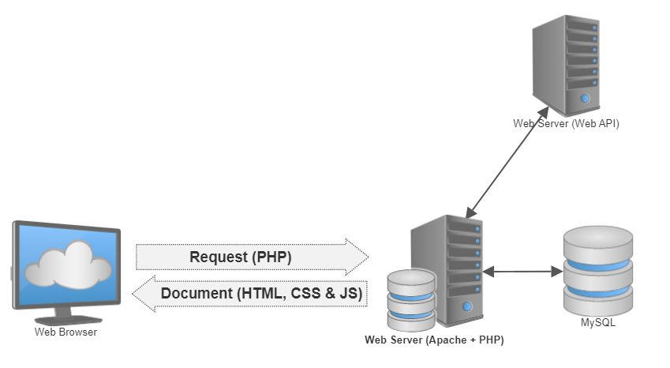
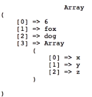
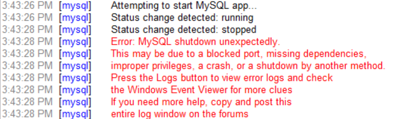

# Back-end webdevelopment met PHP

Bij Back-End wordt door de client een request gestuurd naar de webserver die op zijn beurt de nodige HTML, CSS en JS bestanden zal aanmaken en als antwoord terugsturen.



We gebruiken hiervoor **PHP taal** die op de server zal verwerkt wordt.

## Installatie software

Om de PHP taal lokaal te kunnen hosten hebben we Apache en PHP nodig en om data te gebruiken ook MySQL.
Om dit operating systeem onafhankelijk te maken is er gekozen om te werken met het installatiepakket XAMPP.

Ga naar [de website van XAMPP](https://www.apachefriends.org/download.html) en download de hoogste PHP versie voor jou operating systeem.
Installeer vervolgens met alle default waarden.

::: warning Installatie path
Zorg er voor dat je installatie path `c:\xampp` is.
:::

Configuratie's kan je doen via het XAMPP controle panel.

Wat als poort 80 reeds bezet is? Je kan jou Apache server ook via een andere poort laten werken.
Ga via het XAMPP control panel naar de `httpd.conf` file en maak onderstaande aanpassingen:

```conf
Servername localhost:80 // wijzig de 80 naar bv 8000
...
listen 80 // wijzig ook hier de 80 naar dezeflde poort als je hierboven hebt gekozen
```
Om te controleren dat je Apache server en PHP goed werken kan je het volgende testbestand `phpinfo.php` aanmaken in de folder `C:\xampp\htdocs`:

```php
<?php
    phpinfo();
?>
```
Tik vervolgens in je browser `localhost[:jouw poort]/phpinfo.php`(het : met jouw poort is enkel nodig als je niet met poort 80 werkt).
Als alles goed is krijg je nu een overzicht van PHP. 

<!-- TODO: uittesten en debugging extensie toevoegen -->

Om een mail te kunnen versturen vanuit onze localhost moeten we enkele instellingen juist zetten.

1. Een google account voorbereiden

* Je maakt hiervoor best een nieuw GMail-account aan die voor ontwikkelingsdoeleinden kan gebruiken.
* Log via een incognitovenster in op het nieuwe GMail-account.
* Kies in je accountbeheer voor dubbele authenticatie (Zorg er voor dat je jouw gsm bij de hand hebt).
* Kies voor App-wachtwoorden, als app kies je email en als apparaat windows computer.
* Klik vervolgens op genereren en kopieer de toegangscode zodat je die straks kan gebruiken.

2. Open het bestand `php.ini` via het XAMPP control panel en pas volgende regels aan:

```ini
[mail function] 
SMTP=smtp.gmail.com
smtp_port=587
sendmail_from = YourGmailId@gmail.com
sendmail_path = "\"C:\xampp\sendmail\sendmail.exe\" -t"
```

3. Ga naar de folder `C:\xampp\sendmail`, open er het bestand `sendmail.ini` en pas volgende regels aan (gewoon de ~ verwijderen):

```ini
[sendmail]
smtp_server=smtp.gmail.com
smtp_port=587
error_logfile=error.log
debug_logfile=debug.log
auth_username=YourGmailId@gmail.com
auth_password=Your-Gmail-app-pasword
force_sender=YourGmailId@gmail.com
```
::: warning Restart Apache server
Je zal de apache server moeten herstarten, je kan dit via XAMPP control panel doen.
:::


## Week 1 - Introductie in PHP


PHP is een **Server-side** scripttaal gebruikt om een webpagina dynamisch te maken. Voor de gebruiker is de PHP scripttaal onzichtbaar, enkel het resultaat er van.

Voor we van start gaan, nog even meegeven dat je ook veel informatie op de [php.net](https://www.php.net/manual/en/) website kan terugvinden.

[Hier](/files/cheatsheet_php.pdf) kan je een cheatsheet terugvinden ter ondersteuning van taken, toetsen, projecten en werkplekleren.

### Inleiding

Net zoals bij Javascript start PHP met een opening tag en eindigt het met een closing tag. Ook wordt elke coderegel beëindigd met een `;`.

```php
<?php
    //Hier komt de PHP code
?>
```
Als we PHP code schrijven dan doen we dat in een bestand met de extensie `.PHP`. Je zou de code ook bv in je HTML kunnen schrijven, maar dan wordt deze niet uitgevoerd.

Om PHP iets te laten weergeven naar de gebruiker gebruiken we het commando `echo`.

```php
<?php
    // Dit zal de tekst Hello world tonen
    echo "Hello world";
    // Dit zal de teksten Hello en world samenvoegen en tonen
    echo "Hello" . " world";
    // Dit zal de som van 2 + 3, dus 5 tonen
    echo 2 + 3;
?>
```
Zoals je in de code hierboven reeds kon vaststellen is het bij PHP eveneens mogelijk om commentaar toe te voegen aan je code. Dit is een 'best-practice' techniek die sterk aangeraden wordt. Het kost je wat extra tijd bij het schrijven van je code, maar nadien haal je er veel winst bij als jij of iemand anders je code moet lezen of aanpassen.

```php
<?php
    // op deze manier kan je een enkele lijn commentaar toevoegen
    /* op deze manier kan je meerdere lijnen commentaar
       toevoegen, of een stukje code tijdelijk uitschakelen */ 
?>
```
### Datatypes

Net zoals in andere programeercode kunnen we variabelen definiëren van verschillende datatypes.

::: tip Tip
Variabele namen zijn hoofdletter gevoelig in PHP, m.a.w. $color, $Color en $COLOR zijn drie verschillende variabelen!
:::

#### Strings

Net zoals bij Javascript kan je je string met `"` of `'` definiëren. Maak er een gewoonte van om dit steeds met `"` te doen.

Het volgende voorbeeld neemt twee string variabelen voegt deze samen in een derde en toont deze vervolgens aan de gebruiker.

```php
<?php
    $groet = "Beste";
    $doel = "studenten";
    $zin = $groet . " " . $doel;
    echo $zin;
?>
```
Je kan ook de variabele in je tekst plaatsen, maar dit werkt enkel als je de tekst met `"`definieert.

```php
<?php
    echo "$zin , welkom in de cursus PHP."
    // het resultaat is: Beste studenten, welkom in de cursus PHP.
    echo '$zin , welkom in de cursus PHP.'
    // het resultaat is: $zin , welkom in de cursus PHP.
    // waarschijnlijk niet het resultaat wat je wou.

    // Als je de komma direct na de inhoud van zin wil moet je duidelijk maken wat de variable is via {}
    echo "{$zin}, welkom in de cursus PHP."
    // Beschouw dit terug als de best-practice.
?>
```
Laten we nu even wat frequent gebruikte bewerkingen met strings bekijken.

```php
<?php
    // definiëren van strings
    $tekst1 = "The quick brown fox";
    $tekst2 = " jumped over the lazy dog.";

    // toevoegen van een string aan een variabele
    $tekst3 = $tekst1;
    $tekst3 .= $tekst2; // $tekst2 toevoegen aan $tekst3

    // tekst in 'lowercase' weergeven
    echo strtolower($tekst3);
    
    // tekst in 'uppercase' weergeven
    echo strtoupper($tekst3);

    // de eerste letter het eerste woord van de string in 'uppercase' weergeven
    echo ucfirst($tekst3);

    // alle eerste letters van de woorden in de string in 'uppercase'weergeven
    echo ucwords($tekst3);

    // de lengte van een string weergeven
    echo strlen($tekst3);

    // alle spaties vooraan en achteraan een string verwijderen
    echo "A" . trim(" B C D ") . "E";
    // het resultaat is dan AB C DE

    // zoek het woord 'brown' en geef vanaf daar de string weer
    echo strstr($tekst3,"brown");

    // vervang het woord 'quick' in de string door 'super-fast'
    echo str_replace("quick", "super-fast", $tekst3);

    // herhaal een aantal keer de string
    echo str_repeat($tekst3, 2);

    // geef het stukje string weer vanaf letter 5 en 10 letters lang
    echo substr($tekst3, 5, 10);

    // geeft de positie van het woord 'brown' weer in de string
    echo strpos($tekst3, "brown");

    // zoek de letter 'z' en geef vanaf daar de string weer
    echo strchr($tekst3, "z");
?>
```

#### Integer

Bij het werken met getallen zijn ook hier de wiskundige regels geldig.

Laten we even frequent gebruikte bewerkingen en functies met integers bekijken:

```php
<?php
    // definiëren van integers
    $getal1 = 3;
    $getal2 = 4;

    // Een gewone berekening
    echo ((1 + 2 + $getal1) * $getal2) / 2 - 5;
    // daarnaast bestaan ook de ++ , -- , += , -= , *= en /= mogelijkheden

    // Geeft de absulute waarde weer
    echo abs(0 - 300);

    // Geeft 2 tot de 8ste macht weer 
    echo pow(2, 8);

    // Geeft de vierkantswortel van 100 weer
    echo sqrt(100);

    // Geeft de rest van de deling 20/7 weer
    echo fmod(20, 7);

    // Geeft een willekeurig getal weer
    echo rand();

    // Geeft een willekeurig getal tussen 1 en 10 weer
    echo rand(1, 10);

    // Geeft weer als een variabele een integer is
    echo is_int($getal2);
?>
```

#### Floating point

De definitie en bewerkingen van integers zijn hier eveneens van toepassing, er zijn enkele specifieke functies mogelijk:

```php
<?php
    $getal1 = 3.14;
    $getal2 = $getal1 + 10;
    $getal3 = 4/3;

    // Geeft het komma getal weer afgerond tot 1 cijfer na de komma
    echo round($getal1);

    // Geeft het komma getal weer als een integer afgerond naar boven
    echo ciel($getal2);

    // Geeft het komma getal weer als een integer afgerond naar beneden
    echo floor($getal3);

    // Geeft weer als een variabele een float is
    echo is_float($getal3);

    // Geeft weer als een variabele numeriek is
    echo is_numeric($getal2);
    // Dit zal dus zowel bij een integer als een float waar als resultaat hebben.
?>
```

#### Array

Net zoals in andere code talen kunnen we hier ook gebruik maken van een array die om het even welk dataytype kan bevatten.

```php
<?php
    // definiëren van een lege array
    $numbers = array();

    // definiëren van een array met voor gedefinieerde objecten
    $numbers = array(4,8,15,16,23,42);

    // geeft het object weer op de index positie startende vanaf 0 
    echo $numbers[1]; // 8

    // definiëren van een array met verschillende datatypes
    $mixed = array(6, "fox", "dog", array("x", "y", "z"));

    // geeft een object in een geneste array terug
    $mixed[3][1]; // y

    // een waarde toewijzen aan een index
    $mixed[2] = "cat";

    // als we dit doen voor een niet bestaande index zal die aangemaakt worden
    $mixed[4] = "mouse";

    // als je niet weet hoeveel indexen er zijn kan je op die manier iets aan het einde toevoegen
    $mixed[] = "horse";

    // vanaf PHP versie 5.4 en later is er een verkorte notitiewijze
    $numbers = [1,2,3];
?>
```

Stel dat je niet exact weet wat er in een array zit en je wil dat om te debuggen even tonen dan kan je dit op volgende manier doen:

```php
<?php
    $mixed = array(6, "fox", "dog", array("x", "y", "z"));
    // debugging
    echo "<pre>" . print_r($mixed) . "</pre>";
?>
```



Een array is dus een geordende structuur op basis van een index nummer. In PHP hebben we echter ook een niet geordende array (associative array) op basis van labels. In vak termen spreekt men van de **Key** en de **Value**.

```php
<?php
    // definiëren van een associative array
    $assoc = array("Voornaam" => "Jan", "Naam" => "Janssen");

    // geeft de value terug voor de key = Voornaam
    echo $assoc["Voornaam"];

    // een value voor een key aanpassen doe je zo
    $assoc["Voornaam"] = "Piet";
?>
```

Laten we nu even enkele frequent gebruikte functies bij arrays bekijken.

```php
<?php
    // we definiëren een array met nummers in willekeurige volgorde
    $numbers = array(8,23,15,42,16,4);

    // Geeft het aantal indexen in een array weer
    echo count($numbers); // 6

    // Geeft het grootste getal weer in een array
    echo max($numbers); // 42

    // Geeft het kleinste getal weer in een array
    echo min($numbers); // 4

    // Sorteert de array van klein naar groot
    sort($numbers);

    // Sorteert de array van groot naar klein
    rsort($numbers);

    // Maakt een door komma gescheiden string van de array
    $num_string = implode(" , ", $numbers);

    // Maakt een array van een door komma gescheiden string
    $input = explode(" , ", $num_string);

    // Geeft weer als een iets voorkomt in een array
    echo in_array(15, $numbers);    // True

    // Geeft de key's uit een array
    array_keys($input);
    // Geeft de value's uit een array
    array_values($input);
?>
```

Je kan nog meer functies terugvinden op [php.net](https://www.php.net/manual/en/ref.array.php)

#### Booleans

In PHP kan je eveneens een **true** of **false** resultaat bewaren in een variabele.

```php
<?php
    // Definiëren van een boolean
    $result1 = true;
    $result2 = false;

    // Controleren of een variabele van het datatype boolean is
    is_bool($result1);
?>
```

#### Ongedefinieerd of NULL

Je kan in PHP perfect een variabele aanmaken die nog geen value heeft.

```php
<?php
    // Definiëren van een variabele zonder waarde of datatype
    $var1 = null;

    // Controlleren of een variabele ongedefinieerd is
    is_nul($var1);

    // Controlleren of een variabele gedefinieerd is
    is_set($var1);

?>
```

#### Conversie naar een ander dataype

Net zoals in C# is het in PHP 'good-practice' om conversie naar een andere datatype zelf te voorzien i.p.v. op PHP te vertrouwen om het voor jou te doen.

```php
<?php
    // We definiëren een nummer
    $var = 3;

    // We converteren dit naar een string
    (string) $var
?>
``` 

#### Constanten

In PHP is er een duidelijk verschil tussen een variabele en een constante. De naam van een constante is steeds in hoofdletters geschreven wordt aangemaakt via een functie en kan ook slechts 1x gedefinieerd worden.

```php
<?php
    // Een constante definiëren
    define("MAX_WIDTH", 980);

    // geeft de waarde van de constante terug
    echo MAX_WIDTH;

?>
```

### Logische beslissingen

Logische beslissingen in PHP werken op identiek dezelfde wijze als in c#. De opbouw van condities is dan weer identiek aan dat van Javascript.

#### if, elseif en else

```php
<?php
    $a = 4;
    $b = 3;
    if ($a > $b) {
        echo "a is groter dan b";
    } elseif($a < $b) {
        echo "a is kleiner dan b";
    } else {
        echo "a en b zijn gelijk";
    }

?>
```

#### switch

```php
<?php
    $a = 1;

    switch ($a) {
        case 0:
            echo "a is gelijk aan 0";
            break;
        case 1:
            echo "a is gelijk aan 1";
            break;
        case 2:
            echo "a is gelijk aan 2";
            break;
        case 3:
            echo "a is gelijk aan 3";
            break;
        default:
            echo "a is niet gelijk aan 0, 1, 2 of 3";
            break;
    }
?>
```

### Herhalingen

De reeds gekende herhalingen komen ook in PHP terug.

```php
<?php
    // While lus
    $i = 0;
    while ($i <=10) {
        echo $i . ", ";
        $i++;
    }

    // Do while lus
    $i = 1;
    do{
        $i++;
        echo "The number is " . $i . "<br>";
    }
    while($i <= 3);

    // For lus
    for ($i = 0; $i <= 10; $i++) {
        echo $i . ", ";
    }

    // Foreach lus met een geordende array
    $ages = array(4,8,15,16,23,42);
    foreach($ages as $age) {
        echo "Age: {$age} <br />";
    }

    // Foreach lus met een ongeordende array
    $persoon = array(
        "Voornaam"  => "Jan",
        "Naam"      => "Janssens", 
        "Adres"     => "Fietslaan 2",
        "Stad"      => "Wandelgem",
        "Postcode"  => "4278"
    );
    foreach($persoon as $attribuut => $data) {
        echo "{$attribuut} : {$data}<br />";
    }
?>
```

In PHP hebben we ook de mogelijkheid om de rest van een herhalingslus over te slaan en onmiddellijk terug naar de conditie van de lus te gaan.

```php
<?php
    // Hier zal nummer 5 overgeslagen worden
    for ($i=0; $i <= 10; $i++){
        if($i==5){
            continue;
        }
        echo $i . ", ";
    }
?>
```

We kunnen echter nog een stap verder gaan en de lus vroegtijdig beëindigen.

```php
<?php
    // Hier zal bij nummer 5 de lus beëindigd worden
    for ($i=0; $i <= 10; $i++){
        if($i==5){
            break;
        }
        echo $i . ", ";
    }
?>
```

### Functies

De structuur van functies in PHP is terug vrij vergelijkbaar aan die van andere programeertalen.

```php
<?php
    // Een voorbeeld van een methode met een default waarde voor een argument
    function groet($input="student"){
        echo "Beste {$input},";
    }
    
    $naam = "Jan Janssens";
    groet($naam);

    // Een voorbeeld van een functie
    function som($getal1,$getal2){
        $som = $getal1 + $getal2;
        return $som;
    }

    $resultaat = som(3, 4);
?>
```

::: warning Noot
Als je meerdere gegevens als resultaat uit een functie wil teruggeven kan je dat doen a.d.h.v. een array.
:::

#### Scope van variabelen 

Je kan niet zomaar aan een globale variabele binnen in een functie.

```php
<?php
    $bar = "geldig buiten de functie";   // globale variabele

    function foo(){
        $bar = "geldig binnen de functie";  // locale variabele
    }

    echo "Variable voor de functie = {$bar}";
    foo();
    echo "Variable na de functie = {$bar}";
?>
```

Als je dit zou testen zal je merken dat `$bar` na de functie ongewijzigd is. Dit komt door dat je in de functie eigenlijk tijdelijk een locale variabele hebt aangemaakt met dezelfde naam i.p.v. de naam te wijzigen zoals je verwacht had.

Om dit op te lossen moeten we 1 regeltje toevoegen:

```php
<?php
    $bar = "geldig buiten de functie";   // globale variabele

    function foo(){
        global $bar;    // Hiermee maak je de globale variable beschikbaar binnen de functie.
        $bar = "geldig binnen de functie";  // locale variabele
    }

    echo "Variable voor de functie = {$bar}";
    foo();
    echo "Variable na de functie = {$bar}";
?>
```

::: warning Noot
De techniek hierboven met het gebruik van `global` zal zelden gebruikt worden, maar het verduidelijkt wel het onderscheid tussen een globaal en lokaal gedefinieerde variabele.
:::

### Oefeningen

::: tip Vertrouwd raken met PHP

Maak de oefeningen op het elektronisch leerplatform en laad die op.

:::

### Take-home opdracht

::: tip Voorbereiding volgende les

Als voorbereiding op de leerstof van volgende week volg je onderstaande videotutorial:

* Hoofdstuk 5 - 7 van [PHP with MySQL Essential Training](https://www.linkedin.com/learning/php-with-mysql-essential-training-1-the-basics)

:::

## Week 2 - PHP en MySQL


[Hier](https://devhints.io/mysql) kan je een cheatsheet terugvinden ter ondersteuning van taken, toetsen, projecten en werkplekleren.

### Opfrissen van SQL

::: tip 
Voor deze cursus moet je geen SQL-statements volledig zelf kunnen samenstellen. Je zal deze voor de oefeningen en taken krijgen, ik verwacht wel dat je begrijpt wat het statement doet en indien nodig kleine aanpassingen kan maken.
:::

Laten we eerst even enkele SQL-statements bekijken om terug vertrouwd te raken met databanken.

```sql
SELECT KLANTNAAM
FROM KLANT
WHERE PLAATS = 'Brugge'
OR PLAATS = 'Oostende;
```
 Geeft de naam van de klanten die in Brugge of in Oostende wonen.

```sql
SELECT AUTEUR_ID
FROM BOEKEN
GROUP BY AUTEUR_ID
HAVING MAX(JAAR) = 1996;
```
Geeft de auteur_id van de auteur die voor het laatst in 1996 een boek heeft uitgegeven.

```sql
SELECT NAAM, TITEL, CATEGORIE, UITGEVER
FROM BOEKEN B INNER JOIN AUTEUR A ON B.AUTEUR_ID = A.AUTEUR_ID
INNER JOIN CATEGORIE C ON B.CAT_ID = C.CAT_ID
INNER JOIN UITGEVER U ON B.UITG_ID = U.UITG_ID;
```
Geeft van al de boeken de naam van de auteur, de titel van het boek, de categorie waartoe het boek behoort en de naam van de uitgever.

#### Een oefendatabase aanmaken en CRUD testen

We starten met de aanmaak van een database en een gebruiker. Je kan dit in **phpMyAdmin** doen.
Je start dit op in je browser met url `localhost[:jouw poort]/phpmyadmin`

```sql
CREATE DATABASE vives;
USE vives;
CREATE USER 'webuser'@'localhost' IDENTIFIED BY "secretpassword";
GRANT ALL PRIVILEGES ON vives.* TO 'webuser'@'localhost';
```

Vervolgens maken we een tabel, ook schema genoemd, aan.

```sql
CREATE TABLE subjects (id INT(11) NOT NULL AUTO_INCREMENT,
menu_name VARCHAR(255),
position INT(3),
visible TINYINT(1),
PRIMARY KEY (id)
);
```

De meest voor de hand liggende interacties met een database zullen **C**reate, **R**ead, **U**pdate en **D**elete query's zijn. Hier zal vaak verwezen worden naar **CRUD** query's.

Laten we even enkele CRUD query's uitvoeren op onze tabel:

```sql
/* Create */
INSERT INTO subjects(menu_name, position, visible) VALUES ('About', 1 , 1);
INSERT INTO subjects(menu_name, position, visible) VALUES ('Payments', 2 , 1);
INSERT INTO subjects(menu_name, position, visible) VALUES ('Loans', 3 , 1);
INSERT INTO subjects(menu_name, position, visible) VALUES ('Contact', 4 , 1);
/* Read */
SELECT * FROM subjects WHERE id=2;
/* Update */
UPDATE subjects SET position='3', visible='0' WHERE id=2;
/* Delete */
DELETE FROM subjects WHERE id=4 LIMIT 1;
```
:::tip Tip
Voeg bij een delete steeds `LIMIT 1` toe aan de query. Zo kan max 1 record gewist worden, zo vermijd je dat je volledig tabel gewist wordt door een foutieve query.
:::

### Basis interactie met een database vanuit PHP

Een typische interactie met een database vanuit PHP ziet er als volgt uit:

1. Connecteren met de database
2. Een query (sql-statement) uitvoeren op de database
3. De ontvangen resultaten gebruiken
4. De ontvangen resultaten loslaten
5. De verbinding met de database afsluiten

```php
<?php
    // de database login gegevens
    $dbhost = 'localhost';
    $dbuser = 'webuser';
    $dbpass = 'secretpassword';
    $dbname = 'vives';

    // 1. Verbinden met de database
    $connection = mysqli_connect($dbhost, $dbuser, $dbpass, $dbname);

    // 2. Een query uitvoeren
    $query = "SELECT * FROM subjects";
    $result_set = mysqli_query($connection, $query);

    // 3. De ontvangen resultaten gebruiken
    while($subject = mysqli_fetch_assoc($result_set)) {
      echo $subject["menu_name"] . "<br />";
    }

    // 4. De ontvangen resultaten loslaten
    mysqli_free_result($result_set);

    // 5. De verbinding met de database afsluiten
    mysqli_close($connection);
?>
```

Je kan ook de ontvangen data in een JSON formaat plaatsen.

```php
// De query uitvoeren
$query = "SELECT * FROM subjects";
$result_set = mysqli_query($connection, $query);
// De data in een associatieve array plaatsen
$data=mysqli_fetch_all($result_set,MYSQLI_ASSOC);
// De data in een JSON formaat plaatsen
echo json_encode($data);
```

### Oefeningen

::: tip Afbeeldingen uit een database visualiseren

Maak de oefeningen op het elektronisch leerplatform en laad die op.

:::

## Week 3 - PHP en MySQL

We gaan nog even verder met het raadplegen van data uit een database.

Eerst even uitleggen wat een **HTTP GET Request** is:

* Er gebeuren geen wijzigingen op de server.
* De data zit in de url geëncodeerd bv `http://...?a=2&b=test`
* De browser geeft geen waarschuwing als je de pagina herlaadt en de GET dus nogmaals uitvoerd.
* De data is dus leesbaar in de URL, bijgevolg is dit geen geschikte manier om gevoelige informatie door te sturen.
* De lengte van een URL is beperkt, bijgevolg ook de hoeveelheid data dat je kan doorsturen.

### Filteren van data

Je kan de table [student](/files/student.sql) importeren met phpMyAdmin.

```sql
SELECT STUDENT_ID,VOORNAAM,NAAM
FROM STUDENT
WHERE SCORE > 70;
```
Geeft ons het studentenID, naam en voornaam van de studenten met een score hoger dan 70%.

De filter is hier dus `WHERE SCORE > 70`.

Als we de filter willen aanpassen is het dus dit deel dat we moeten wijzigen.
Als we dus enkel de studenten uit de campus Brugge willen zien dan moeten we het sql-statement als volgt aanpassen.

```sql
SELECT STUDENT_ID,VOORNAAM,NAAM
FROM STUDENT
WHERE SCORE > 70
AND CAMPUS = 'Brugge';
```

Meestal hebben we geen behoefte aan zo'n statische filter maar moet dit een dynamisch gegeven zijn.
Laten we hiervoor variabelen gebruiken.

```php
<?php
    // Filter variabelen
    $score = 70;
    $campus = "Brugge";
    // Sql-statement
    $query = "SELECT STUDENT_ID,VOORNAAM,NAAM FROM STUDENT WHERE SCORE > 70 AND CAMPUS = 'Brugge';";
?>
```

Nu moeten we die variabelen in het sql-statement krijgen, hiertoe passen we de code wat aan.

```php
<?php
    // Filter variabelen
    $score = 70;
    $campus = "Brugge";
    // Sql-statement
    $query = "SELECT STUDENT_ID,VOORNAAM,NAAM FROM STUDENT WHERE SCORE > {$score} AND CAMPUS = '{$campus}';";
?>
```
Laten we dit nu uitbreiden tot een HTTP GET Request.
Stel dat ons bestand de naam filter.php heeft en de client tikt volgende url in `filter.php?score=60&campus='Brugge'`.
Nu willen we die informatie gebruiken in onze filter.

```php
<?php
    // Filter variabelen
    $score = 70;
    $campus = "Brugge";
    // Is de score doorgegeven via een HTTP GET parameter?
    if(isset($_GET["score"])){
        $score=$_GET["score"];
    }
    // Is de campus doorgegeven via een HTTP GET parameter?
    if(isset($_GET["campus"])){
        $campus=$_GET["campus"];
    }
    // Sql-statement
    $query = "SELECT STUDENT_ID,VOORNAAM,NAAM FROM STUDENT WHERE SCORE > {$score} AND CAMPUS = '{$campus}';";
?>
```

Stel dat we de filter van de campus niet willen gebruiken dan lukt dit op die manier niet, we moeten dan onze sql-statement wat aanpassen.
Dit kunnen we als volgt doen:

```php
<?php
    // Filter variabelen
    $score = 70;    
    // Is de score doorgegeven via een HTTP GET parameter?
    if(isset($_GET["score"])){
        $score=$_GET["score"];
    }
    // Sql-statement
    $query = "SELECT STUDENT_ID,VOORNAAM,NAAM FROM STUDENT WHERE SCORE > {$score}";
    // Is de campus doorgegeven via een HTTP GET parameter?
    if(isset($_GET["campus"])){
        $campus=$_GET["campus"];
        $query = $query . " AND CAMPUS = '{$campus}';";    
    } else {
        $query = $query . ";";    
    }    
?>
```

### Oefeningen

::: tip Producten uit een database visualiseren en filteren

Maak de oefeningen op het elektronisch leerplatform en laad die op.

:::

## Week 4 - PHP, FORMS en MySQL

Laten we starten met een form aan te maken in het php bestand `mysql_form.php` die input mogelijk maakt.

```php
<form action="mysql_form.php" method="POST">
    Menu Name: <input name="menu_name" /><br />
    position: <input type="number" name="position" /><br />
    visible: <input type="number" min="0" max="1" name="visible" /><br/>
    <input type="submit" />
</form>
```
Merk op dat we als actie dezelfde pagina laten oproepen met een HTTP POST Request om de ontvangen data door te geven.

Om nu te weten of de pagina via een GET of een POST werd aangesproken gaan we als volgt te werk.

```php
<?php
    // Is het een POST request?
    if($_SERVER['REQUEST_METHOD']=='POST')
    {
        // Hier komt de php code om de form af te handelen...
    }
?>
<!-- Input Form -->
<form action="mysql_form.php" method="POST">
    Menu Name: <input name="menu_name" /><br />
    position: <input type="number" name="position" /><br />
    visible: <input type="number" min="0" max="1" name="visible" /><br/>
    <input type="submit" />
</form>
```

Laten we nu stap voor stap de data verwerken.
Verplaats `// Hier komt de php code om de form af te handelen...` door onderstaande code

```php
    // de database login gegevens
    $dbhost = 'localhost';
    $dbuser = 'webuser';
    $dbpass = 'secretpassword';
    $dbname = 'vives';

    // Verbinden met de database
    $connection = mysqli_connect($dbhost, $dbuser, $dbpass, $dbname);

    // We gaan hier straks verder    
```

Nu moeten we de input gaan toevoegen aan onze database. We mogen die input niet zomaar gebruiken. Hacker zouden in een inputveld kunnen een `;` plaatsen gevolgd door een SQL statement waardoor ongewenste interactie met onze database zou kunnen onstaan. We gebruiken `mysqli_real_escape_string()` om dit risico uit te sluiten. Daarna kunnen we onze SQL statement opbouwen en uitvoeren. Vervang `// We gaan hier straks verder` door onderstaande code.

```php
  // Escapen van de inputdata  
  $menu_name=mysqli_real_escape_string($connection,$_POST['menu_name']);
  $position=mysqli_real_escape_string($connection,$_POST['position']);
  $visible=mysqli_real_escape_string($connection,$_POST['visible']);
  // Het SQL statement opbouwen
  $insert = "INSERT INTO subjects (menu_name, position, visible) VALUES ('{$menu_name}','{$position}','{$visible}');";
  // Het SQL statement uitvoeren
  mysqli_query($connection,$insert);
```
### Paswoorden versleutelen

Een gebruikersnaam en paswoord worden bij registratie bewaard in een database. Om er voor te zorgen dat een paswoord veilig bewaard is in een database moet deze versleuteld worden. Doe je dit niet dan kan een hacker eenmaal toegang gekregen tot jou database met alle gebruikersnamen en paswoorden aan de slag.

::: danger Waarschuwing
Het is bij wet verplicht om paswoorden versleuteld te bewaren. Hier staan zeer hoge boetes op!
:::

Om een paswoord te versleutelen gebruiken we een **hash-functie** deze gebruikt een algoritme (naar keuze) om het paswoord om te vormen in een niet leesbare reeks van karakters. Waarbij het eerste deel het algoritme bevat.

Het is onmogelijk om vanuit de hash het paswoord te berekenen. Bij gevolg moet je het ingebrachte paswoord met het zelfde algoritme versleutelen en dan deze vergelijken met de in de database bewaarde hash.

Om een paswoord te versleutelen ga je als volgt te werk

```php
$hash=password_hash($password,PASSWORD_DEFAULT);
```
Om een bij een login form dan het paswoord te controleren gaan we als volgt te werk

```php
if(password_verify($password_input, $hash)){

}
```

### Oefeningen

::: tip Registreren van een nieuw account

Maak de oefeningen op het elektronisch leerplatform en laad die op.

:::

## Week 5 - PHP, FORMS en MySQL

Laten we even kijken hoe we een afbeelding kunnen uploaden en bewaren in een database.

We starten met het aanmaken van een nieuwe database door het volgende sql-statement uit te voeren in onze MySQL tool:

```sql
CREATE TABLE images2 (
  id int(11) NOT NULL AUTO_INCREMENT,
  file_path varchar(255) NOT NULL,
  PRIMARY KEY (id)
);
```

Laten we nu een HTML formulier aanmaken in het bestand `index.php`:

```php
<!DOCTYPE html>
<html lang="en">
    <head>
        <meta charset="UTF-8">
        <meta http-equiv="X-UA-Compatible" content="IE=edge">
        <meta name="viewport" content="width=device-width, initial-scale=1.0">
        <title>Upload image</title>
        <link rel="stylesheet" href="bootstrap/css/bootstrap.min.css">
    </head>
    <body>
        <!-- form -->
        <form action="" method="post" enctype="multipart/form-data" class="mb-3">
            <h3 class="text-center mb-5">Upload image</h3>

            <div class="user-image mb-3 text-center">
                <div style="width: 100px; height: 100px; overflow: hidden; background: #cccccc; margin: 0 auto">
                
                </div>
            </div>

            <div class="custom-file">
                <input type="file" name="fileUpload" class="custom-file-input" id="chooseFile">
                <label class="custom-file-label" for="chooseFile">Select file</label>
            </div>

            <button type="submit" name="submit" class="btn btn-primary btn-block mt-4">
                Upload File
            </button>
        </form>

        <!-- foutmeldingen -->

        <script src="/scripts/script.js"></script>
    </body>
</html>
```

We maken gebruik van [Bootstrap](https://getbootstrap.com/docs/4.6/getting-started/download/) voor de opmaak, plaats de uitgepakte ZIP file in je projectfolder en hernoem deze folder `bootstrap`.

We plaatsten als een `placeholder` voor de afbeelding met een blanko `src`. Laten we die nu visualiseren bij een upload.
We maken hiervoor het Javascript bestand `script.js` aan:

```js
const chooseFile = document.getElementById("chooseFile");
const imgPreview = document.getElementById("imgPlaceholder");

chooseFile.addEventListener("change", function () {
    getImgData();
});

function getImgData() {
    let files = chooseFile.files[0];
    if (files) {
      const fileReader = new FileReader();
      fileReader.readAsDataURL(files);
      fileReader.addEventListener("load", function () {
        imgPreview.src =this.result;
      });    
    }
}
```

Een submit van deze form zal via een HTTP POST Request zichzelf terug oproepen.
We vangen dit via PHP bovenaan de form op maken verbinding met onze database:

```php
<?php
    // Is het een POST request?
    if($_SERVER['REQUEST_METHOD']=='POST')
    {
        // de database login gegevens
        $dbhost = 'localhost';
        $dbuser = 'webuser';
        $dbpass = 'secretpassword';
        $dbname = 'vives';
        // Verbinden met de database
        $connection = mysqli_connect($dbhost, $dbuser, $dbpass, $dbname);   
        
        // Hier komen enkele variabele definities

        // De validatiecode komt hier

        // De code om de afbeelding op te laden en in onze database te registreren komt hier
    }
?>
```

Laten we eerst controleren of de afbeelding wel bestaat.
We definieren eerst enkele variabelen:
```php
        // Folder voor de afbeeldingen 
        $target_dir = "images/";

        // Naam van het bestand 
        $target_file = $target_dir . basename($_FILES["fileUpload"]["name"]);
        
        // Extensie van het bestand
        $imageExt = strtolower(pathinfo($target_file, PATHINFO_EXTENSION));
```
::: tip Tip
Je zal een folder `images` moeten aanmaken in het project.
:::

Nu kunnen we controleren of de afbeelding wel bestaat:
```php
        // Controle of afbeelding bestaat.
        if (!file_exists($_FILES["fileUpload"]["tmp_name"])) {
            $resMessage = array(
                "status" => "alert-danger",
                "message" => "Select image to upload."
            );
        }
```
Als we de afbeeling niet kunnen vinden dan maken we een foutmeldingsarray die we straks zullen tonen aan de gebruiker.

Stel dat we enkel bestandstypes `jpg`, `jpeg` en `png` wil toelaten dan kan je de code als volgt uitbreiden.
We definieren eerst een array met de toegelaten bestandstypes:

```php
        // Toegelaten bestandstypes
        $allowd_file_ext = array("jpg", "jpeg", "png");
```
Gevolgd door de validatie van bestandstype:

```php
        // Enkel jpg, jpeg en png toelaten
        else if (!in_array($imageExt, $allowd_file_ext)) {
            $resMessage = array(
                "status" => "alert-danger",
                "message" => "Allowed file formats .jpg, .jpeg and .png."
            );
        }
```

Om te vermijden dat grote bestanden opgeladen worden kunnen we de grootte beperken tot 2MB door de code met onderstaande aan te vullen:

```php
        // max 2Mb groot
        else if ($_FILES["fileUpload"]["size"] > 2097152) {
            $resMessage=array(
                "status"=> "alert-danger",
                "message"=> "File is too large. File size should be less than 2 megabytes."
            );
        }
```

Tot slot kunnen we nog controleren of het bestand niet al reeds is opgeladen:"

```php
        // Is deze afbeelding al opgeladen ?
        else if (file_exists($target_file)) {
            $resMessage = array(
                "status" => "alert-danger",
                "message" => "File already exists."
            );
        }
```

Als we door de validatie raken kan onze afbeelding opgeladen worden en kunnen we die registreren in onze database:

```php
        // afbeelding opladen en registreren in onze database
        else {
            if (move_uploaded_file($_FILES["fileUpload"]["tmp_name"], $target_file)) {
                // Het SQL statement opbouwen
                $insert = "INSERT INTO images2 (file_path) VALUES ('{$target_file}')";
        
                // Het SQL statement uitvoeren
                $result = mysqli_query($connection,$insert);
                if($result){
                    $resMessage = array(
                        "status" => "alert-success",
                        "message" => "Image uploaded successfully."
                    );                 
                }
            }else {
                $resMessage = array(
                    "status" => "alert-danger",
                    "message" => "Image coudn't be uploaded."
                );
            }
        }
```

Stel dat er foutmeldingen zijn moeten we die nu onder onze form tonen aan de gebruiker:

```php
        <!-- foutmeldingen -->
        <?php 
            if(!empty($resMessage)) {
                echo "<div class='alert {$resMessage['status']}'>\n";
                echo "<p>{$resMessage['message']}</p>\n";
                echo "</div>\n";
            }
        ?>
```

### Oefeningen

::: tip Aanpassen accountgegevens

Maak de oefeningen op het elektronisch leerplatform en laad die op.

:::

## Week 6 - PHP en mail

We maken gebruik van de intern voorziene mailservice van XXAMP.

De basis van het sturen van een mail ziet er als volgt uit:

```php
<?php
    $to_email = "receipient@gmail.com";
    $subject = "Simple Email Test via PHP";
    $body = "Hi, This is test email send by PHP Script";
    $headers = "From: sender email";

    if (mail($to_email, $subject, $body, $headers)) {
        echo "Email successfully sent to $to_email...";
    } else {
        echo "Email sending failed...";
    }
?>
```

Test dit uit zodat je zeker bent dat je email configuratie in orde is.

Laten we even een voorbeeld uitwerken van een contactform.
Je hebt een afbeelding voor dit voorbeeld nodig dat je [hier](/files/banner.jpg) kan downloaden.

Maak een nieuw project folder aan met en plaats hierin :
* een `bootstrap` folder
Kopier hier de bootstrap files in.

* een `styles` folder met een `style.css` bestand met onderstaande inhoud
```css
html {
    background-color: peru;
}

body {
    background-color: white;
    width: 600px;
    margin-left: auto;
    margin-right: auto;
    padding: 10px;
}

img {
    max-width: 100%;
}
```
We zullen deze style gebruiken om onze mail van een opmaak te voorzien.

* een `images` folder
Plaats hier het gedownloade `banner.jpg` bestand in

* een contactform `contact.php` met onderstaande inhoud
```php
<!DOCTYPE html>
<html lang="en">
    <head>
        <meta charset="UTF-8">
        <meta http-equiv="X-UA-Compatible" content="IE=edge">
        <meta name="viewport" content="width=device-width, initial-scale=1.0">
        <title>Send mail</title>
        <link rel="stylesheet" href="bootstrap/css/bootstrap.min.css">
    </head>
    <body>
        <?php
            // Is het een POST request?
            if($_SERVER['REQUEST_METHOD']=='POST')
            {
                //Ontvangen gegevens
                $to_email=$_POST['email'];
                $clientname=$_POST['name'];
                $message=$_POST['message'];

                // subject definieren
                $subject = "Copy of your contact request";

                // server bestanden inladen
                $content = file_get_contents("./styles/style.css");
                $img = file_get_contents('./images/banner.jpg');
                $imgdata = base64_encode($img);

                // html body definieren                
                $body = <<<EOF
                    <html>
                    <head>
                    <style>
                    $content
                    </style>
                    </head>
                    <body>
                    
                    <p>Hi $clientname,</p>
                    <p>We have recieved your message and will get back to you within the next few working days.</p>
                    <p>$message</p>
                    <p>Dev team CDD</p>
                    </body>
                    </html>
                EOF;

                // Set content-type header for sending HTML email 
                $headers = "MIME-Version: 1.0" . "\r\n"; 
                $headers .= "Content-type:text/html;charset=UTF-8" . "\r\n"; 
 
                // Mail versturen
                $result=mail($to_email, $subject, $body, $headers);
            }
        ?>
        <div class="row justify-content-center">
            <div class="col-md-6 col-md-offset-3" id="form_container">
                <h2>Contact Us</h2>
                <p>Please send your message below. We will get back to you at the earliest!</p>
                <form role="" method="post" id="reused_form">

                    <div class="row">
                        <div class="col-sm-12 form-group">
                            <label for="message">
                                Message:</label>
                            <textarea class="form-control" type="textarea" name="message" id="message" maxlength="6000" rows="7"></textarea>
                        </div>
                    </div>
                    <div class="row">
                        <div class="col-sm-6 form-group">
                            <label for="name">
                                Your Name:</label>
                            <input type="text" class="form-control" id="name" name="name" required>
                        </div>
                        <div class="col-sm-6 form-group">
                            <label for="email">
                                Email:</label>
                            <input type="email" class="form-control" id="email" name="email" required>
                        </div>
                    </div>


                    <div class="row">
                        <div class="col-sm-12 form-group">
                            <button type="submit" class="btn btn-lg btn-default pull-right" >Send →</button>
                        </div>
                    </div>

                </form>
                <?php
                    // Is het een POST request?
                    if($_SERVER['REQUEST_METHOD']=='POST')
                    {
                        if($result){
                            echo "<div class='alert alert-success'>\n";
                            echo "<h3>Posted your message successfully!</h3>\n";
                            echo "</div>";
                        }
                        else {
                            echo "<div class='alert alert-danger'>\n";
                            echo "<h3>Error</h3>\n";
                            echo "<p>Sorry there was an error sending your form.</p>";
                            echo "</div>";
                        }
                    }
                ?>
            </div>
        </div>    
    </body>
</html>
```

### Oefeningen

::: tip Inschrijven en uitschrijven voor nieuwsbrief

Maak de oefeningen op het elektronisch leerplatform en laad die op.

:::

## Troubleshooting

::: details Mijn MySQL server wil niet meer opstarten

De precieze oorzaak kon ik nog niet achterhalen, maar soms loopt er iets fout tijdens het afsluiten van de MySQL server. Hierdoor lukt het opstarten de volgende keer niet meer.



**Work-around**

1. Ga naar de folder `C:\xampp\mysql` en maak er een nieuwe folder `FIX_BACKUP` aan.
2. Kopier de folders `C:\xampp\mysql\backup` en `C:\xampp\mysql\data` naar de nieuwe folder `C:\xampp\mysql\FIX_BACKUP`.
3. Kopier de inhoud van de folder `C:\xampp\mysql\backup` naar de folder `C:\xampp\mysql\data` waarmee je alle bestanden overschrijft.
4. Kopier het bestand `ibdata1` uit de folder `C:\xampp\mysql\FIX_BACKUP\data` naar `C:\xampp\mysql\data` waarmee je het bestand ook terug overschrijft.

Nu zou de MySQL server terug moeten opstarten.

Start nu phpMyAdmin op en voer onderstaande sql-statement uit om onze gebruiker terug toe te voegen :

```sql
CREATE USER 'webuser'@'localhost' IDENTIFIED BY "secretpassword";
GRANT ALL PRIVILEGES ON vives.* TO 'webuser'@'localhost';
```

:::